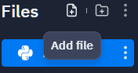
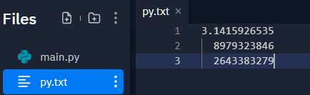

# Reading from a File

## Learning Goals

*By the end of this module you should be able to answer the following:*

* 

## Code

*It is important to practice code and challenge our brain in new ways. Do all of the problems below, including the example problems. They will make you a better programmer.*

### Example Problems

*Example problems are best if you code them up yourself and store them. Don't just copy and paste, code them in and make them work. If you are really smart about it, you'll remake them slightly differently to really establish your learning.*

#### Problem: Reading an entire file in one big chunk

To begin, we need a file with a few lines of text in it. Let’s start with a file
that contains pi to 30 decimal places with 10 decimal places per line:

Create a text file with the following: 

```txt
3.1415926535
  8979323846
  2643383279
```

Save it as py.txt





Here’s a program that opens this file, reads it, and prints the contents
of the file to the screen:

```python
with open('pi.txt') as file_object:
    contents = file_object.read()
    print(contents)
```

The first line of this program has a lot going on. Let’s start by looking
at the open() function. To do any work with a file, even just printing its contents,
you first need to open the file to access it. The open() function needs
one argument: the name of the file you want to open. Python looks for this
file in the directory where the program that’s currently being executed is
stored. In this example, file_reader.py is currently running, so Python looks
for pi_digits.txt in the directory where file_reader.py is stored. The open()
function returns an object representing the file. Here, open('pi_digits.txt')
returns an object representing pi_digits.txt. Python stores this object in
file_object, which we’ll work with later in the program.

Once we have a file object representing pi_digits.txt, we use the read()
method in the second line of our program to read the entire contents of
the file and store it as one long string in contents. When we print the value
of contents, we get the entire text file back:

```txt
3.1415926535
  8979323846
  2643383279
```
The only difference between this output and the original file is the
extra blank line at the end of the output. The blank line appears because
read() returns an empty string when it reaches the end of the file; this empty
string shows up as a blank line. If you want to remove the extra blank line,
you can use rstrip() in the print statement:

`print(contents.rstrip())`


#### Problem: Reading a file line by line 

```python
with open('py.txt') as file_object:
    for line in file_object:
        print(line)
```

```python
with open('py.txt') as file_object:
    for line in file_object:
        print(line.strip())
```

#### Problem: You want to read an entire file in as a list to use later

```python
with open("py.txt") as file_object:
    lines = file_object.readlines()
for line in lines:
    print(line.rstrip())
```

```python
with open("py.txt") as file_object:
    lines = file_object.readlines()

pi_string = ""

for line in lines:
    pi_string += line.rstrip()

print(pi_string, len(pi))
```

```python
with open("py.txt") as file_object:
    lines = file_object.readlines()

pi_string = ""

for line in lines:
    pi_string += line.strip()

print(pi_string, len(pi))
```

#### Problem: You want to write to an empty file

One of the simplest ways to save data is to write it to a file. When you write
text to a file, the output will still be available after you close the terminal
containing your program’s output. You can examine output after a program
finishes running, and you can share the output files with others as well. You
can also write programs that read the text back into memory and work with
it again later.

To write text to a file, you need to call open() with a second argument telling
Python that you want to write to the file. To see how this works, let’s write a
simple message and store it in a file instead of printing it to the screen:

```python
filename = 'programming.txt'
with open(filename, 'w') as file_object:
    file_object.write("I love programming.")
```


```python
filename = 'programming.txt'
with open(filename, 'w') as file_object:
    file_object.write("I love programming.")
    file_object.write("Programming is awesome!")
```

#### Problem appending to the end of a file

```python
with open(filename, 'w') as file_object:
    file_object.write("I love programming.")
    file_object.write("Programming is awesome!")

with open(filename, 'a') as file_object:
    file_object.write("I love finding meaning in large datasets.\n")
    file_object.write("I love creating apps that can run in a browser.\n")
```


### Practice Problems

*Practice questions are essential to mastering a skill. Often, you will be asked to do things you haven't exactly done yet, or not at all. Be challenged by it and see if you can get google, the person next to you, or the teacher, to help before you stop working.*


#### Practice: Reading a file

Open a blank file in your text editor and write a few
lines summarizing what you’ve learned about Python so far. Start each line
with the phrase In Python you can.... Save the file as learning_python.txt in the
same directory as your exercises from this chapter. Write a program that reads
the file and prints what you wrote three times. Print the contents once by reading
in the entire file, once by looping over the file object, and once by storing
the lines in a list and then working with them outside the with block.

#### Practice: Manipulating a file on the fly

You can use the replace() method to replace any word in a
string with a different word. Here’s a quick example showing how to replace
'dog' with 'cat' in a sentence:
>>> message = "I really like dogs."
>>> message.replace('dog', 'cat')
'I really like cats.'
Read in each line from the file you just created, learning_python.txt, and
replace the word Python with the name of another language, such as C. Print
each modified line to the screen.


#### Practice: Writing files

Guest: Write a program that prompts the user for their name. When they
respond, write their name to a file called guest.txt.

#### Practice: Appending to files

Guest Book: Write a while loop that prompts users for their name. When
they enter their name, print a greeting to the screen and add a line recording
their visit in a file called guest_book.txt. Make sure each entry appears on a
new line in the file.

#### Practice appending to files II

Programming Poll: Write a while loop that asks people why they like
programming. Each time someone enters a reason, add their reason to a file
that stores all the responses.


#### Meaty practice

Create a program that reads from the text document "class_grades.txt". 

* Find who has the highest score in the class and what their score was. 
* Find the average of all scores 
* Find the standard deviation of all scores (note, check python modules)
* Find the z scores of each student (try not to use pandas or scipi)
* Use python to write a file with that information in the following format: 
  * > Lastname, Adam: score, z-score
* Bonus kudos if the text file is in highest to lowest order 