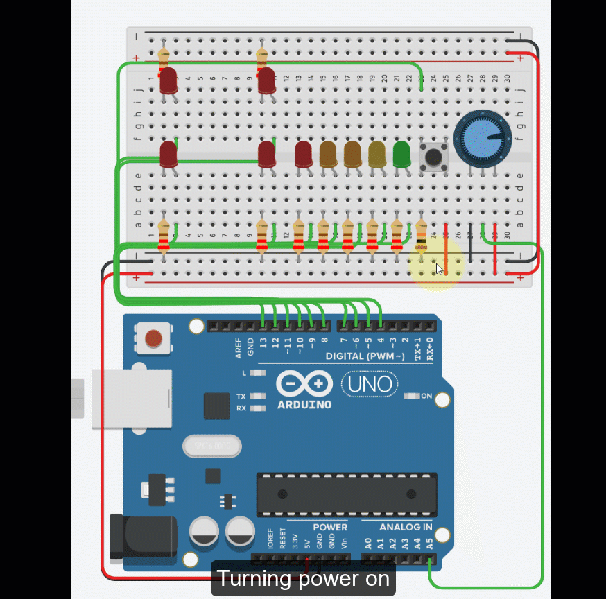

# Challenge Creative

## Required Mastery

* Buttons
* Potentiometer
* Digital Read
* Analog Read
* Digital Write

## Challenge

You are to create the following circuit that approximates the one shown below:

* When the button is pressed the LEDs flash for 5 seconds and then stop
* The LEDs flash in an X pattern.
  * ON:  TOP_LEFT & BOTTOM_RIGHT
  * OFF: BOTTOM_LEFT & TOP_RIGHT
  * ---
  * ON:  BOTTOM_LEFT & TOP_RIGHT
  * OFF: TOP_LEFT & BOTTOM_RIGHT
* The LEDs flash delay is dynamic based on the potentiometer
* The potentiometer at 0% flashed the light at 100ms and 100% at 500ms
* IF the button is free to be pressed, the LED on pin 4 is on (The green LED).
* When the button is pressed the LED on pin 8 (RED) turns on
* Every second the LED will move towards the green pin until the button is enabled again