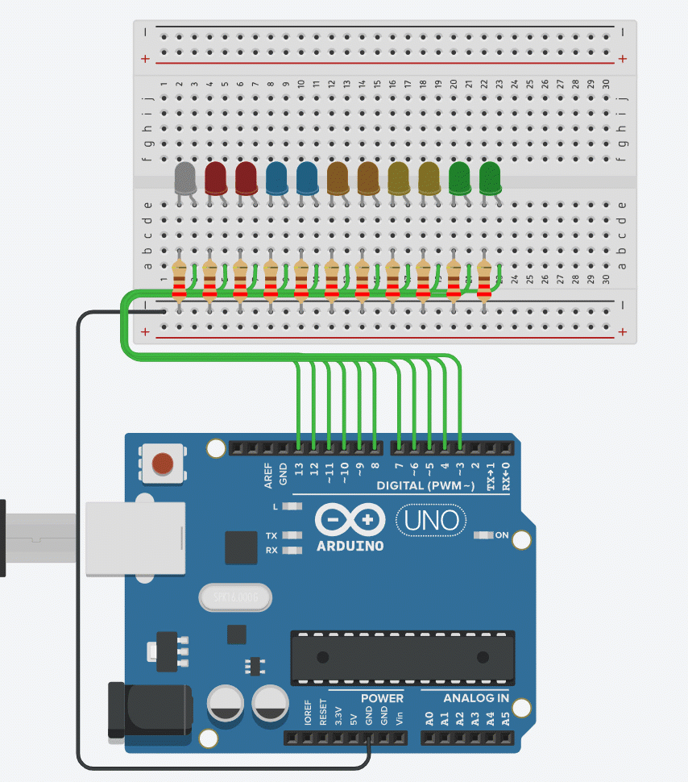

# Challenge Introduction to Arduino

## Masteries

To complete this challenge you will need to have a mastered a range of skills and gained a level of understanding. Some of which you may not have acquired yet.

### Required Mastery

You should have completed the mastery questions from the following sections

* Using TinkerCad to simulate circuits
* Setting Pin Modes
* Writing to digital sensors
* [For loops](learning\c\micro_lessons\iteration\for_loops_basics\for_loops_basics.md)

### Recommended Masteries

* Printing stuff in Arduino
* What are Sensors?
* if statements
* if/else statements
* if/else-if/else statements

## Challenge: Scrolling LEDs

### Materials

You will need:

* 11x LEDs of various colours
* 11 220 Ohm resistors
* 1x Arduino Uno

### Challenge description

You are challenged to created the following circuit. 

Recommendations: if your first instinct is to write a metric tonne of if/else statements, don't. There are easier ways. 
