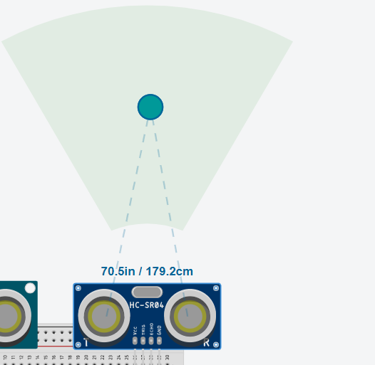
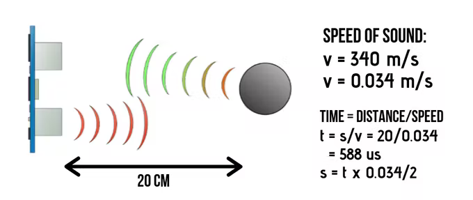
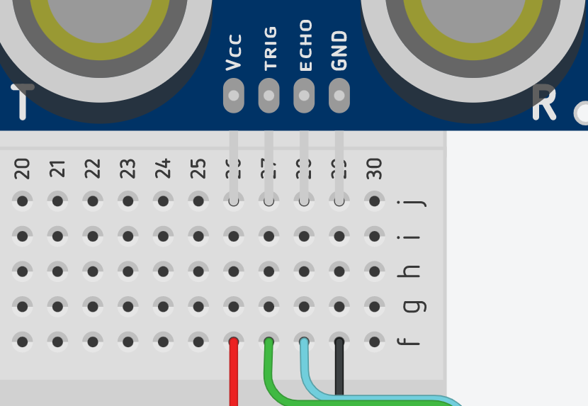
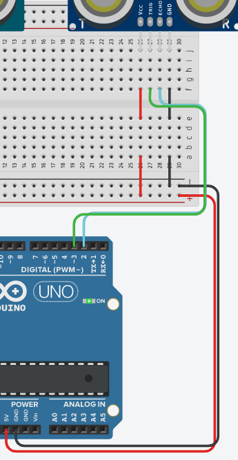

# Using a Distance sensor 

## Topics covered

"At the end of this learning brief, you will be able to answer the following questions"

* What is a distance sensor?
* How does a distance sensor work?
* How to convert time to distance?
* How to use a function to return the distance

## Learning Resources

* [How to mechatronics: Distance sensor page](https://howtomechatronics.com/tutorials/arduino/ultrasonic-sensor-hc-sr04/)
* [How to mechatronics: Distance sensor video](https://www.youtube.com/watch?v=ZejQOX69K5M)

## Topics

### What is a distance sensor

In our Engineering labs we use the HC-SR04 Ultrasonic Distance Module. This module broadcasts a burst of sound on the ultrasound frequency range and measures how long it takes for the echo to come back.

### How does the distance sensor work?




The HC-SR04 has a microphone and a speaker. It broadcasts from the speaker and it listens to the the microphone and measures the delay between the two. 



### Wiring up a distance sensor

Wiring up the distance is fairly direct: 



The Vcc is where voltage comes into the sensor. The sensor we have takes 5 volts so we don't have to worry about resistors. The sensor must be grounded to the same source as power is supplied. 



You also need to attach two pins, a trigger and an echo.

The trigger is an `OUTPUT` and echo is an `INPUT` pinModes.

### Measuring how long it takes for the sound to echo

```cpp
#define trigPin 2
#define echoPin 3
long duration;

void setup(){
    Serial.begin(9600);
    pinMode(trigPin, OUTPUT);
    pinMode(echo, INPUT);
}
void loop(){
    digitalWrite(trigPin, LOW);
    delayMicroseconds(2);
    digitalWrite(trigPin, HIGH);
    delayMicroseconds(10);
    digitalWrite(trigPin, LOW);
    duration = pulseIn(echoPin, HIGH);
    Serial.println(duration);
}
```

### Converting time into distance

Converting duration to a distance is just a bit of maths: 

```cpp
#define trigPin 2
#define echoPin 3
long duration;

void setup(){
    Serial.begin(9600);
    pinMode(trigPin, OUTPUT);
    pinMode(echo, INPUT);
}
void loop(){
    digitalWrite(trigPin, LOW);
    delayMicroseconds(2);
    digitalWrite(trigPin, HIGH);
    delayMicroseconds(10);
    digitalWrite(trigPin, LOW);
    duration = pulseIn(echoPin, HIGH);
    distance = duration * 0.034;
    Serial.println(distance);
}
```

Hey, that distance seems a bit too far. Why is that? Well, it's because we measured for the time get to the object and for it to come back. That means the distance is actually half of that time. 

```cpp
#define trigPin 2
#define echoPin 3
long duration;
int distance;

void setup(){
    Serial.begin(9600);
    pinMode(trigPin, OUTPUT);
    pinMode(echo, INPUT);
}
void loop(){
    digitalWrite(trigPin, LOW);
    delayMicroseconds(2);
    digitalWrite(trigPin, HIGH);
    delayMicroseconds(10);
    digitalWrite(trigPin, LOW);
    duration = pulseIn(echoPin, HIGH);
    distance = duration * 0.034 / 2;
    Serial.println(distance);
}
```


### Using a function to return the distance to allow for code reuse

```cpp
#define trigPin 2
#define echoPin 3
int distance;


unsigned long ping(int trigPin, int echoPin){
  long duration;
  digitalWrite(trigPin, LOW);
  delayMicroseconds(2);
  digitalWrite(trigPin, HIGH);
  delayMicroseconds(10);
  digitalWrite(trigPin, LOW);
  duration = pulseIn(echoPin, HIGH);
  return duration * 0.034 / 2; 
}

void setup(){
    Serial.begin(9600);
    pinMode(trigPin, OUTPUT);
    pinMode(echo, INPUT);
}
void loop(){
    Serial.println(ping(trig, echo));
}
```

### What's up with the 3 pin distance sensor

There is another form of distance sensor that shares the same pin for trigger and echo. The biggest difference is that we need to constantly change the pinMode.


```cpp
unsigned long ping(int sig){
  long duration;
  pinMode(sig, OUTPUT);
  digitalWrite(sig, LOW);
  delayMicroseconds(2);
  digitalWrite(sig, HIGH);
  delayMicroseconds(10);
  digitalWrite(sig, LOW);
  pinMode(sig, INPUT);
  return pulseIn(sig, HIGH) * 0.034 / 2;
}
```

## Mastery Questions

### Mastery Question 1

Create a circuit that uses:

* A bespoke function that you have written to return the distance
* The map function to return more useful data for your LEDs

To complete the following circuit


