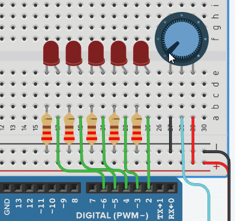
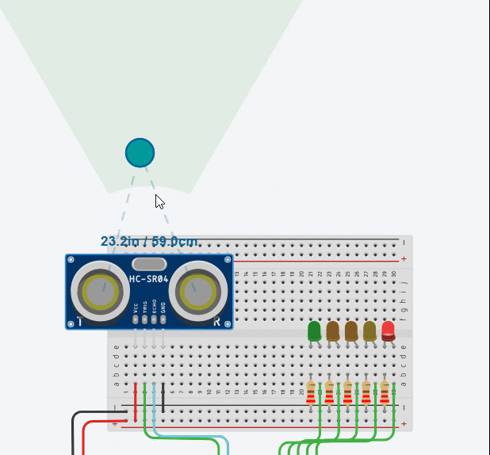

# Topic

## Learning Goals 

* Know what signals are and understand how to relates to microcontrollers 
* Know what analog and digital signals mean and understand how they can be used in microcontrollers
* Know what Pulse Width Modulation is and understand how it can be used to simulate an Analog signal
* Know what for loops are and are able to make small modifications to given ones 
* Able to extend your current and previous knowledge and understanding to create a small body of work that uses analog/PWM input to drive output. 

## Practices 
One of the best ways to master your learning is to practice and develop your Knowledge and Understanding of a topic by practising and thinking about the topic; often in different ways.

### Dictionary Corner
Nobody would doubt that having strong literacy skills is important for almost every part of life. The same is true in technical subjects: sharing a common technical literacy makes it easier for professionals to talk to each other. 

* In Electrical/Electrical Engineering what do they consider a signal? 
* What is an analog signal, give an example. 
* What is a digital signal, give an example. 
* How does Pulse Width Modulation work to emulate an Analog signal? 
* Describe how you might count from 0 to 9 using a for loop, and what would you need to do to count from 9 back to 0? 

### Practice 1

Consider the following animation

Using what you know of programming a microcontroller. Create a system that allows for this interaction.

### Practice 2

Follow the video of using an ultrasound sensor. 

