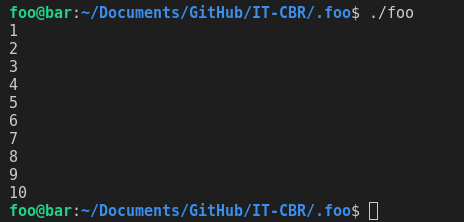
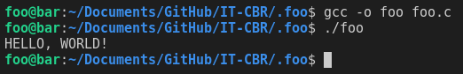

# Cookbook: How to use for loops

## Topics covered

"At the end of this learning brief, you will be able to answer the following questions"

* What are for loops? 
* What the different parts of a for loop are. 

## Learning Resources

* [Arduino C/C++: For loops](https://www.arduino.cc/reference/en/language/structure/control-structure/for/)

## Topics

### Using for loops

For loops are in effect, a very specific while loop: 

```cpp
#include <stdio.h>
#include <string.h>

int main(void){

    int i = 0;              // set the iterator to 0
    while (i < 10){         // while the iterator is less than 10
        printf("%d\n", i);  // print this out
        i++;                // increment the iterator by one
    }

    // a for loop does the same thing but on one line
    //  (set iterator; iterator is less than end; increment iterator by 1)
    for (int i = 0; i < 10; i++){
        printf("%d\n", i);
    }
    return 0;
}
```

The most popular usage of a for loop in C/C++ is to count numbers.

```cpp
#include <stdio.h>
#include <string.h>

int main(void){
    // counts from 0 to 9
    for (int i = 0; i < 10; i++){
        printf("%d\n", i);
    }

    // counts from 1 to 10
    for (int i = 1; i <= 10; i++){
        printf("%d\n", i);
    }
    // counts down from 9 to 0
    for (int i = 9; i >= 0; i--){
        printf("%d\n", foo[i]);
    }
    return 0;
}
```

## Practice Questions

### Practice Question 1

Complete the following code: 

```cpp
int main(void){
    int foo[] = {1, 2, 3, 4, 5, 6, 7, 8, 9, 10};

    // complete the for loop

    return 0;
}
```

output: 




### Practice Question 2

Complete the following code:

NOTE: You can use the toupper() function to change a character to upper case!

```cpp
#include <stdio.h>
#include <string.h>
#include <ctype.h>

int main(void){
    char foo[] = "hello, world!";
    // complete this code 

    return 0;
}
```

output:



## Mastery Questions

### Mastery Question 1

```cpp
#include <stdio.h>
#include <string.h>

int main(void){
    char foo[4][20] = {
        "ada",
        "bobby",
        "charlie",
        "erik"
    };

    // create a for loop to print out each person's name

    return 0;
}
```

### Mastery Question 2

```cpp
#include <stdio.h>
#include <string.h>

int main(void){
    char foo[4][20] = {
        "ada",
        "bobby",
        "charlie",
        "erik"
    };

    // create a for loop to print out each person's name in reverse order

    return 0;
}
```

### Mastery Question 3

```cpp
#include <stdio.h>
#include <string.h>

int main(void){
    char foo[4][20] = {
        "ada",
        "bobby",
        "charlie",
        "erik"
    };

    // create a for loop to capitalise each person's name and then print them out

    return 0;
}
```
