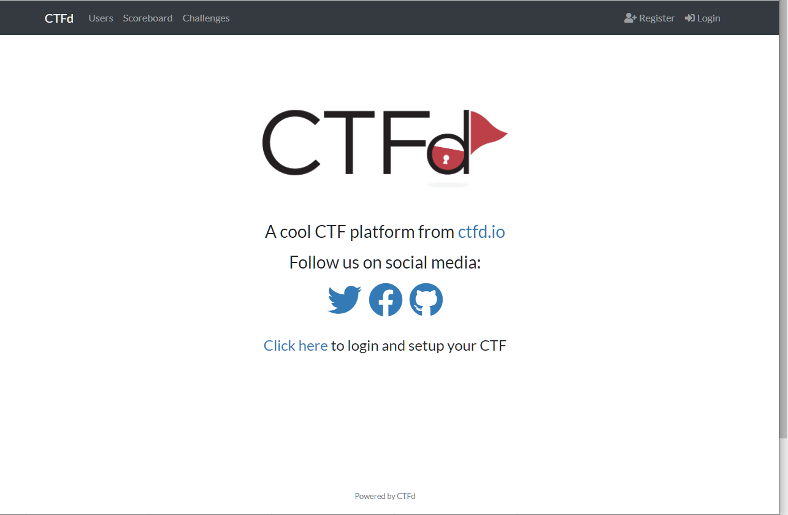
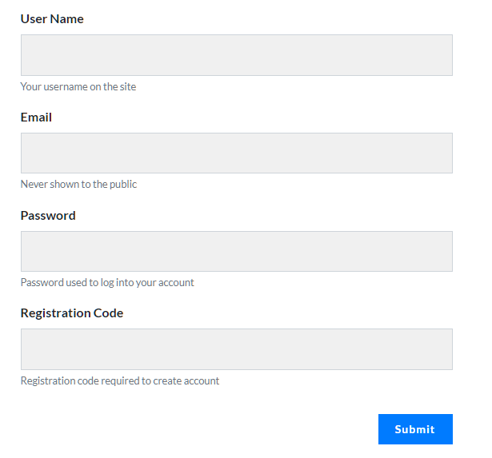
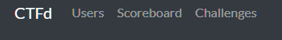
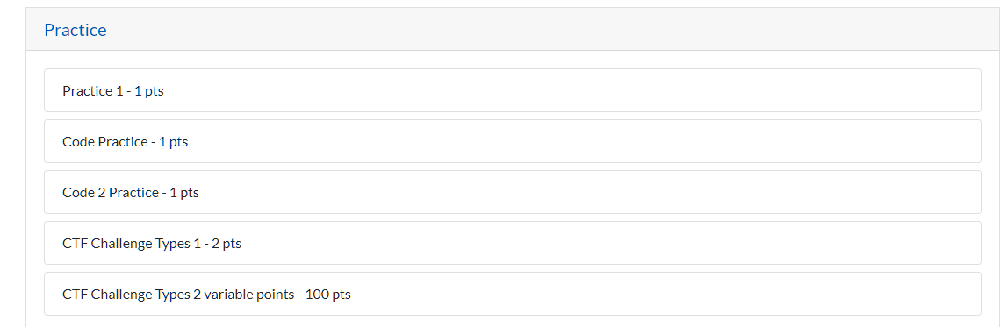
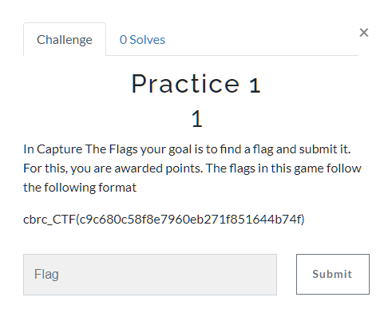
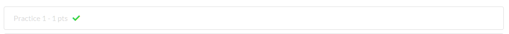
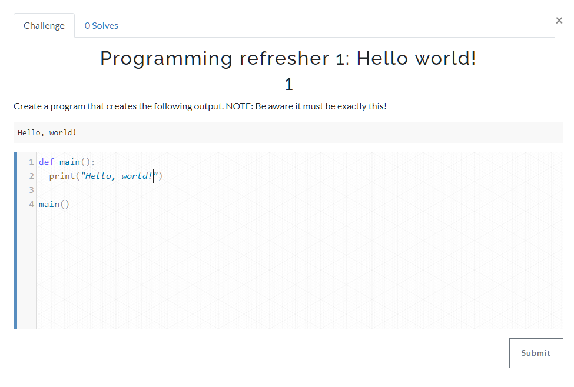

# Capture the Flag

## Topics covered

"At the end of this learning brief, you will be able to answer the following questions"

* What are capture the flags?
* What are flags?
* How can you enter a simple flag?
* How can code act like a flag?

## Topics

### What are CTFs (Capture The Flags)

CTF (Capture The Flag) is a kind of information security competition that challenges contestants to solve a variety of tasks ranging from a scavenger hunt on wikipedia to basic programming exercises, to hacking your way into a server to steal data. In these challenges, the contestant is usually asked to find a specific piece of text that may be hidden on the server or behind a webpage. This goal is called the flag, hence the name!

### What are Flags 

This competition uses two types of flags: 

static flags that look like this: 

`cbrc_CTF(70051bfb846b5ebb9372ce4ba789f85a)`

Most other competitions use {} instead of (). I am using () because I am lazy.

The second type is a code response. You'll be asked to create a program that responds to input and produces some sort of specific output.

### Topic Using CTFd

Go to the top right corner and click register

Fill in the details. Just make your username GivenI

Where I is your initial.

Make sure you use your registration code (from google classrooms)

Click on challenges

Click on practice: 

Click on practice 1

If you have completed a challenge it will have a tick next to it

You can enter static flags (like we saw above) or we can submit coding flags

