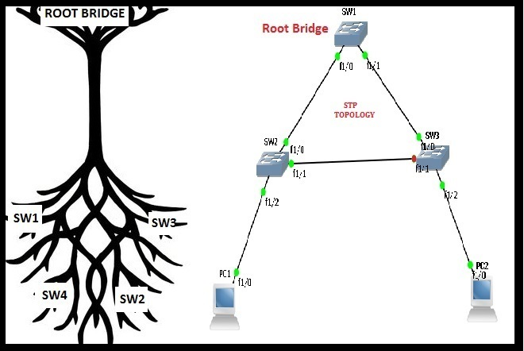
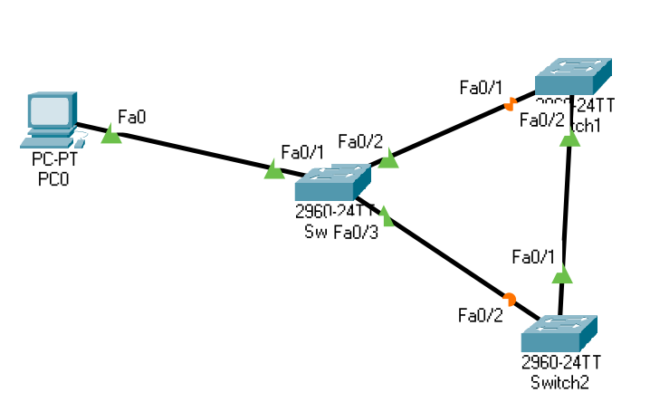
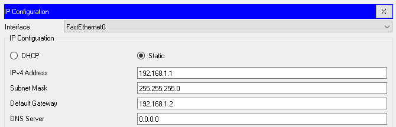
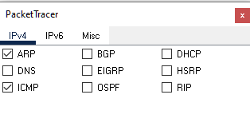
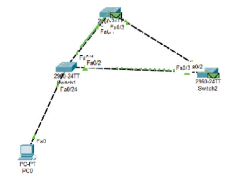
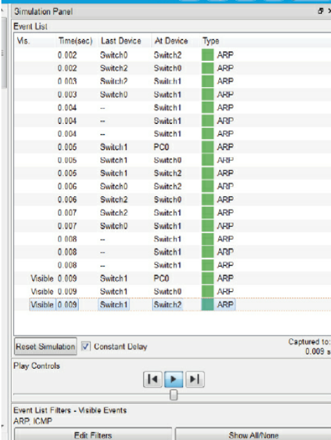

# Detecting Switching loops. 

## Learning Objectives

* Know what switching loops are and why they are bad
* Know how to use the simulation mode
* Gain knowledge on what ARP is. 
* Gain an awareness of the spanning tree protocol

### What is a switching loop?
A switching loop or bridge loop occurs in computer networks when there is more than one layer 2 path between two endpoints (e.g. multiple connections between two network switches or two ports on the same switch connected to each other). The loop creates broadcast storms as broadcasts and multicasts are forwarded by switches out every port, the switch or switches will repeatedly rebroadcast the broadcast messages flooding the network.

### What is simulation mode? 

Allows you to gain an insight on what is actually happening on a network. 

### What is ARP? 

The Address Resolution Protocol (ARP) is a communication protocol used for discovering the link layer address, such as a MAC address, associated with a given internet layer address, typically an IPv4 address. This mapping is a critical function in the Internet protocol suite

### What is spanning tree protocol? 

Spanning Tree Protocol (STP) was developed before switches were created in order to deal with an issue that occured where network bridges were creating loops. STP served two main purposes: 

1. Prevents problems by loops on a network by detecting multiple hosts. 
2. Allows for loops to be used as redundant routes. 

The difference between a bridge and a switch is that a switch functions like a multiport bridge; where as a bridge may only have two to four ports a switch looks like a hub with as many as 12 to 48 ports. 

STP is a layer 2 protocol that passes data back and forth to find out how the switches are organised on the network and then takes all of that information it gathers and uses it create a logical tree. Part of the information STP receives defines exactly how the network interconnects. 

STP builds this information by sending out network packets called Bridge Protocol Data Units (BPDUs or BDUs). BDUs inform the way that STP determine the network topology. 




## Purpose
Learn how to diagnose and solve switching loops. 

**NOTE:** Never attempt this on a production network. 

## Lab 

### Topology



Connect three switches and one PC onto the canvas and connect them using straight through copper. 

## Steps

### Step 1: Configure the PC: 


IP: 192.168.1.1
Subnet mask: 255.255.255.0
Gateway: 192.168.1.2



### Step 2: Disable spanning tree

Configure all three switches so they have a readable name and then configure the interfaces so that that spanning tree is turned off. 

```bash
Switch>enable
Switch#config terminal
Enter configuration commands, one per line.  End with CNTL/Z.
Switch(config)#hostname Switch0
Sw0(config)#interface range f0/1-3
Switch0(config)#no spanning-tree vlan 1
Switch0(config)#end
Switch0#
%SYS-5-CONFIG_I: Configured from console by console
```

### Step 3: Simulation mode

Set packet tracer to simulating mode so you can see the packets moving across the network. Set `edit features` to show only ARP and ICMP. 



### Task 4: Sending a packet. 

Go back to the PC and ping `192.168.1.2` and then press the play button. Keep pressing play and watch the packet travel around the network endless, never resolving the ARP request



Notice how the capture window fills up with ARP requests. This will eventually cause your network to crash. 



### Step 5: Fixing STP

To fix this issue we re-enable STP on the switches for VLAN1. 

```bash
Switch0#configure terminal 
Switch0(config)#interface range f0/1-3 
Switch0(config-if-range)#spanning-tree vlan 1 
Switch0(config-if-range)#end
```


