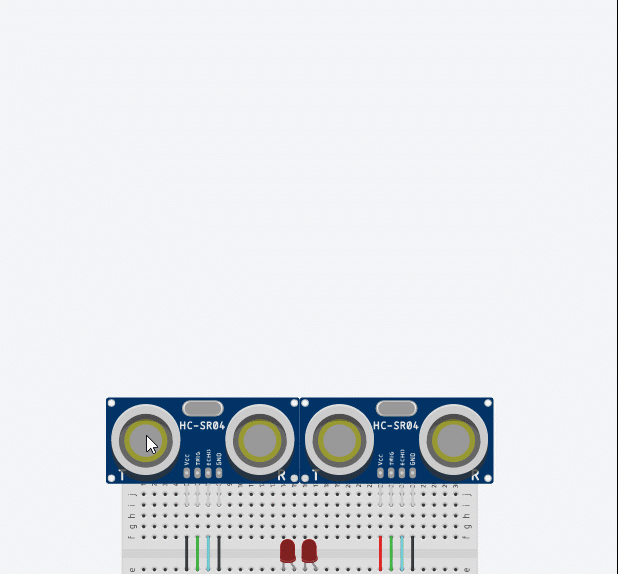

# Challenge Analog and Digital Signals 

One of the best ways of learning is to start with a challenge and learn the steps of solving that challenge.

* They provide clear learning objects for the learner: learners are given a clear goal to achieve.
* When linked with scaffolded training, learners don't have to worry about going down the wrong path
* Promotes active learning
* Fosters problem solving skills

## Prerequisite learning

To solve the following challenge, you may need to complete the following cookbooks:

* [Cookbook: Digital Signals](../../cookbook/arduino/foundations.programming.signals.md)
* [Cookbook: Distance Sensors](../../cookbook/arduino/foundations.arduino.distance_sensors.md)

## Challenge

You are challenged to created the following circuit.

Requirements: 

You must use a single function for both distance sensors.

### Challenge
Using the animation below, create a solution that can detect when something is roughly equal distance between two sensors.

