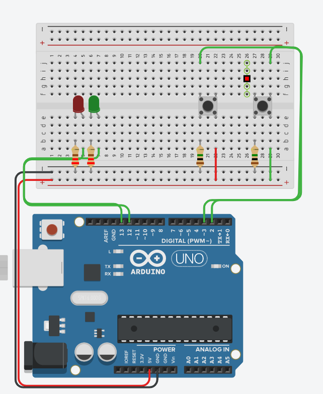

# Making decisions in code 

## Learning Goals

*By the end of this module you should be able to answer the following:*

* How do you make decisions in code?
* How to use a button? 
* How to read input from an Arduino as a variable? 


#### Knowledge checklist

* [How do breadboards work?](https://github.com/carteras/IT-CBR/blob/main/cookbook/electronics/foundations.breadboards.md)
* [Digital Signals](https://github.com/carteras/IT-CBR/blob/main/cookbook/electronics/foundations.digitalsignals.md)
* [Buttons how do they work?](https://github.com/carteras/IT-CBR/blob/main/cookbook/electronics/foundations.buttons.md)
* [Making decisions in code](https://github.com/carteras/IT-CBR/blob/main/cookbook/arduino/foundations.programming.conditions.md)


## Commands | Code

*It is important to practice commands | code and challenge our brain in new ways. Do all of the problems below, including the example problems. They will make you a better programmer | operator.*


### Single led action

Using the following design and circuit create the following code


### Master challenge 

Using the recorded example in class design and write the code required to make it

Extra spicy challenge: 

* Do it in fewer than 52 lines of properly formatted code

When you've built it in TinkerCad help me find the components to build it for real!


## Fluff about find out

So, you've learnt lots of things so far today. I challenge you to use your imagination and try and find some things that you feel you might be able to do, but weren't necessarily taught.

Because it's our first week, I am happy to give you some hints to start you off, but go nuts.

* Can you make a circuit with a single LED that only turns on if two buttons are pressed?
* Can you make a circuit with two buttons that, each turns on a corresponding LED?

## Bug hunt

Kevin has written some code and it doesn't work. What's wrong with it?



```cpp
#define LED_RED 13
#define LED_GREEN 12
#define BUTTON_LEFT 3
#define BUTTON_RIGHT 2
# No, they are fine

int btn;

void setup()
{
  pinMode(LED_RED, OUTPUT);
  pinMode(LED_GREEN, OUTPUT);
  pinMode(BUTTON_LEFT, INPUT);
  pinMode(BUTTON_RIGHT, INPUT);
}

void loop()
{
  if (digitalRead(BTN_LEFT)) (
    digitalWrite(LED_RED, ON); 
    digitalWrite(LED_GREEN, OFF);
  } else if (digitalRead(BTN_RIGHT));{
    digitalWrite(LED_RED, ON);
    digitalWrite(LED_GREEN, OFF);
  } else {
    digitalWrite(LED_RED, 0):
    digitalWrite(LED_GREEN, 0);
  }
     
}
```