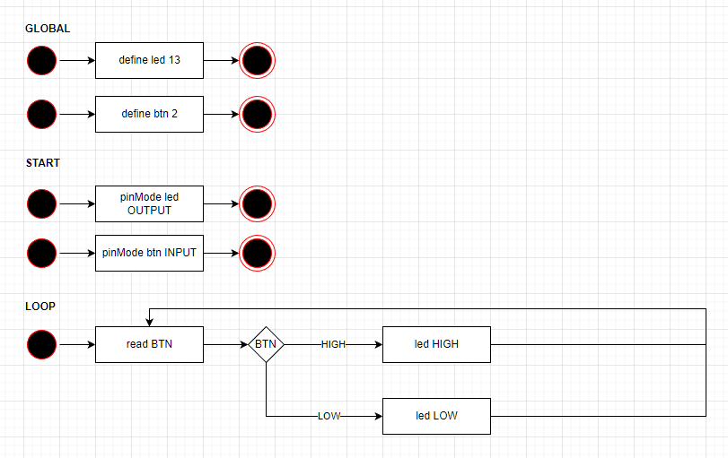
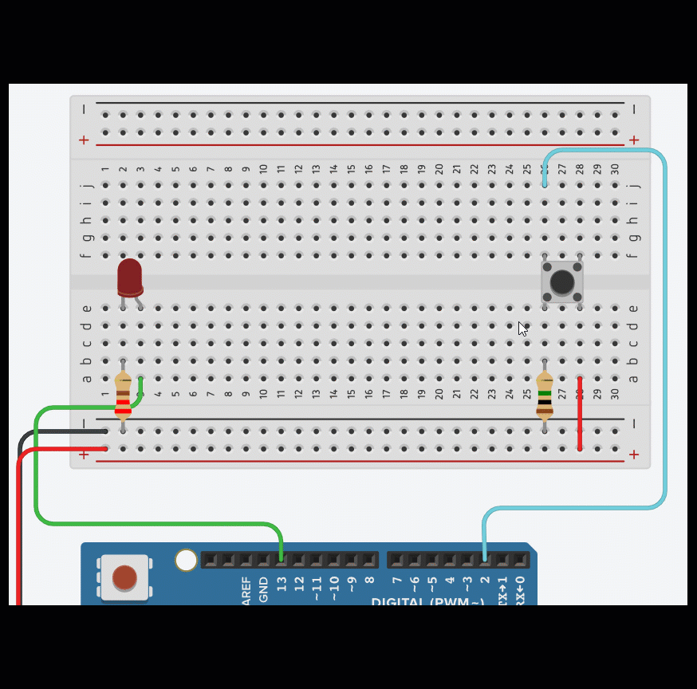

# Making decisions in code 

## Learning Goals

*By the end of this module you should be able to answer the following:*

* How do you make decisions in code?
* How to use a button? 
* How to read input from an Arduino as a variable? 

#### Knowledge checklist

* [How do breadboards work?](https://github.com/carteras/IT-CBR/blob/main/cookbook/electronics/foundations.breadboards.md)
* [Digital Signals](https://github.com/carteras/IT-CBR/blob/main/cookbook/electronics/foundations.digitalsignals.md)
* [Buttons how do they work?](https://github.com/carteras/IT-CBR/blob/main/cookbook/electronics/foundations.buttons.md)
* [Making decisions in code](https://github.com/carteras/IT-CBR/blob/main/cookbook/arduino/foundations.programming.conditions.md)

## Commands | Code

*It is important to practice commands | code and challenge our brain in new ways. Do all of the problems below, including the example problems. They will make you a better programmer | operator.*

### Single led action

Using the following design and circuit create the following code

## Fluff about find out

So, you've learnt lots of things so far today. I challenge you to use your imagination and try and find some things that you feel you might be able to do, but weren't necessarily taught.

Because it's our first week, I am happy to give you some hints to start you off, but go nuts.

* Can you make a circuit with a single LED that only turns on if two buttons are pressed?
* Can you make a circuit with two buttons that, each turns on a corresponding LED?

## Bug hunt

Kevin has written some code and it doesn't work. What's wrong with it?
