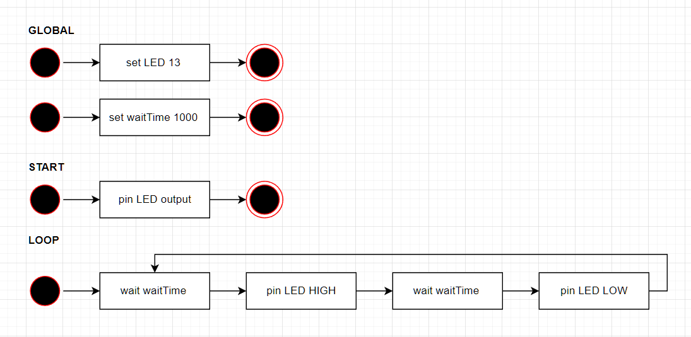
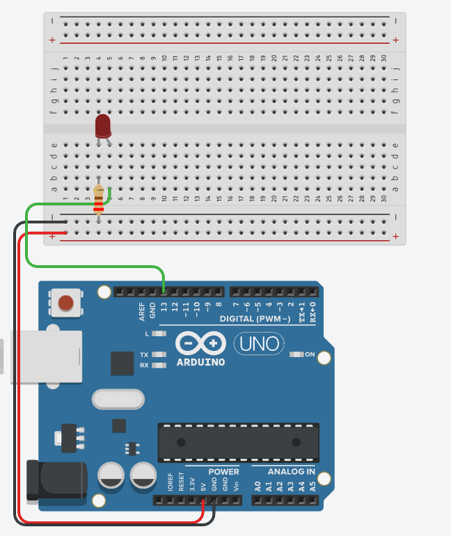
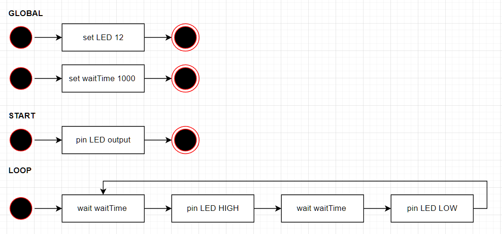

# Hello world

## Learning Goals

*By the end of this module you should be able to answer the following:*

* Know what `start` and `loop` do when an Arduino runs code
* Know what a variable is
* Have an awareness of why we have some variables outside both `start` and `loop`
* Be able to combine your knowledge to make some circuits. 


## Examples

### Example: Turn the onboard LED on and off 



```cpp
int LED = 13;
int waitTime = 1000;

void setup()
{
  pinMode(LED, OUTPUT);
}

void loop()
{
  digitalWrite(LED, HIGH);
  delay(waitTime); 
  digitalWrite(LED, LOW);
  delay(waitTime); 
}
```

### Example: Add an external LED



### Example: Change the pin used in external LED external LEDs




```cpp
int LED = 12;
int waitTime = 1000;

void setup()
{
  pinMode(LED, OUTPUT);
}

void loop()
{
  digitalWrite(LED, HIGH);
  delay(waitTime); 
  digitalWrite(LED, LOW);
  delay(waitTime); 
}
```


## Practice Questions

### Practice: Design and make a circuit with two alternating LEDS

## Fluff about find out

So, you've learnt lots of things so far today. I challenge you to use your imagination and try and find some things that you feel you might be able to do, but weren't necessarily taught.

Because it's our first week, I am happy to give you some hints to start you off, but go nuts.

* What does pinMod really do?
* What does digitalWrite do? Is there an analogWrite? Is there a digitalRead?
* Can you make a series of LEDs that use pins 2 through 13? 
  * How can you change which LED is on dynamically?
  
hint: 

```cpp
// stuff happens before this

if (currentPin == 13) {
    currentPin = 2;
}

// more stuff might happen after this
```

* What does if mean? Can you find a reference for the Arduino language?
* What does `==` mean? How does it differ from `=?`
* What does the `{ ... }` part mean?


## Bug hunt

Kevin has written some code and it doesn't work. What's wrong with it? (Kevin isn't very good)

```cpp
int start(){
  int LED = 14;
  digitalMode(LED, OUTPUT);
}

loop()[
  pinPrint(LED, HIGH);
  wait(1000):
  digitalWrite(LED, LOW);
  delayMicroseconds(1000000);
]
```