# Testing in packet tracer

## Learning intentions and selection criterion

### Learning intentions

*What are we learning in this brief?*

* How you can create tests to make sure that the network is working.
* manual testing with `ipconfig` and `ping`
* PDUs
  * What are PDUs?
  * How to make a simple PDUs
  * How to make a complex PUDs
* How to use simulation mode to watch your packets move
* How to use the Scenario tool to test different conditions

### Selection criterion

*I will know I have learned this when I can:"

* find out my network details using ipconfig
* ping the local machine using ping
* ping remote machines using ping
* use tracert to search the network
* create a simple PDU to test the network
* create an advanced PDU to test a service (HTTP)
* use the scenario tool

## Topic | Commands | Code

*It is important to practice commands | code and challenge our brain in new ways. Do all of the problems below, including the example problems. They will make you a better programmer | operator.*

### Using CLI tools 

Consider the following network: 

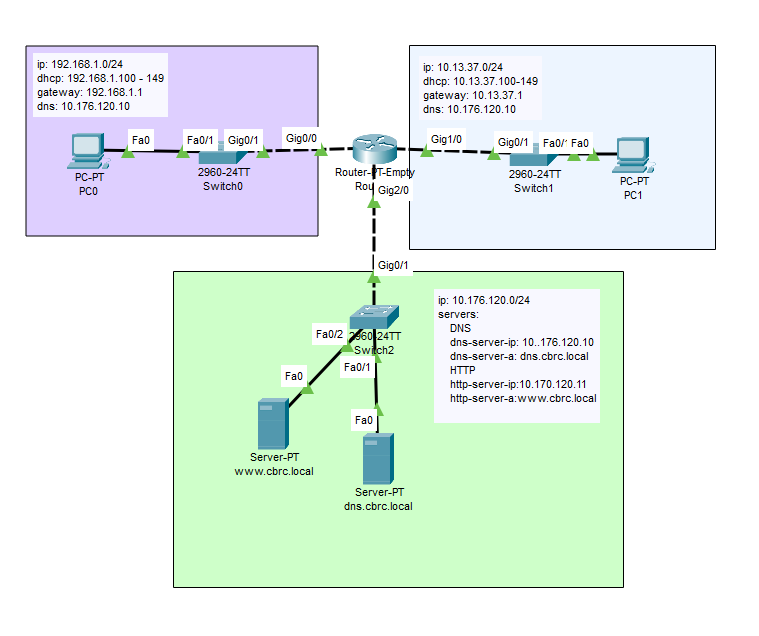

You can use the example from lab.5.1

#### ipconfig

`ipconfig` is a command used on Windows computers to see network-related information like your computer's IP address.

- `ipconfig`: When you type this command alone, it displays the current network connections and their configurations. 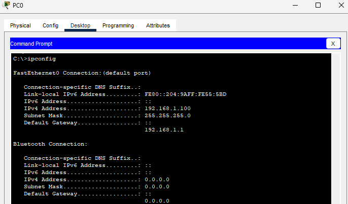
  
- **IPv4 Address**: This is your computer's unique address on the local network. Other devices use this to identify and communicate with your computer.
    - Example: 192.168.1.10
  
- **Subnet Mask**: Determines the size of the network. In most home networks, this might be 255.255.255.0.
  
- **Default Gateway**: It's like a door out of your local network. If your computer wants to talk to another device not on your local network, it goes through this "door".
    - Example: 192.168.1.1 – usually the address of your router.
  
- **DNS Servers**: These are like address books for the internet. When you type a website's name, DNS servers convert that name into an IP address that computers understand.
    - Example: 8.8.8.8 – Google’s public DNS server.
  
- `ipconfig /all`: Displays detailed information about all network interfaces, including MAC addresses, DNS servers, and more. 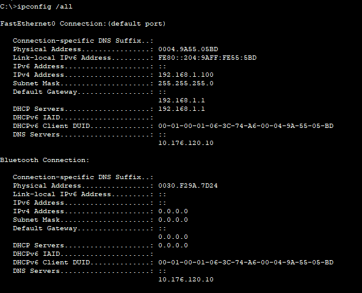
  
- `ipconfig /release`: Used to release (or drop) the IP address currently assigned to the computer.
  
- `ipconfig /renew`: Used to get a new IP address from the network's DHCP server.
  
- **Physical Address**: This is the MAC address. It's a unique identifier for your network card/device.

- **DHCP Enabled**: Tells you if the computer gets its IP automatically from the network or if it's set manually.


#### ping 

`ping` is a command used to test the connection between your computer and another device on a network or the internet.


```cmd
C:\>ping 192.168.1.1

Pinging 192.168.1.1 with 32 bytes of data:

Reply from 192.168.1.1: bytes=32 time<1ms TTL=255
Reply from 192.168.1.1: bytes=32 time<1ms TTL=255
Reply from 192.168.1.1: bytes=32 time<1ms TTL=255
Reply from 192.168.1.1: bytes=32 time<1ms TTL=255

Ping statistics for 192.168.1.1:
    Packets: Sent = 4, Received = 4, Lost = 0 (0% loss),
Approximate round trip times in milli-seconds:
    Minimum = 0ms, Maximum = 0ms, Average = 0ms
```

- `ping`: Used to test the reachability of a host (like a website or another computer) and measure the round-trip time it takes for packets (tiny bits of data) to travel to that host and back.
  
- **Destination Host**: The device or website you're trying to ping.
    - Example: `ping google.com` – tests the connection to Google's servers.
  
- **Packets**: Small bits of data sent from your computer to the host.
  
- **Time (ms)**: The time, in milliseconds, it takes for the data to go to the host and back. A smaller number is faster.
  
- **TTL (Time to Live)**: It's a value in the ping response indicating the maximum number of network hops (or passes through devices) the packet is allowed before being discarded.

- **Request Timed Out**: This means the ping didn't receive a reply from the host within the expected time. Could be due to network issues or host being unreachable.
  
- **4 packets sent, 4 received**: Typically, `ping` sends 4 packets to test the connection. This line tells you how many were sent and how many made it back.

- **Lost**: Tells you how many packets (if any) didn't make it back. Losing packets can indicate network problems.


#### tracert

`tracert` is a command used to trace the route data packets take from your computer to a destination, showing all the stops (hops) along the way.

```cmd
C:\>tracert 10.176.120.10

Tracing route to 10.176.120.10 over a maximum of 30 hops: 

  1   0 ms      0 ms      0 ms      192.168.1.1
  2   0 ms      0 ms      0 ms      10.176.120.10

Trace complete.

C:\>tracert cbrc.local

Tracing route to 10.176.120.10 over a maximum of 30 hops: 

  1   0 ms      0 ms      0 ms      192.168.1.1
  2   0 ms      4 ms      0 ms      10.176.120.10

Trace complete.
```

- `tracert`: Displays the path that packets take to reach a destination and provides details about each hop along that path.
  
- **Destination Host**: The device or website you're trying to trace the route to.
    - Example: `tracert google.com` – traces the route to Google's servers.

- **Hops**: Each step or jump in the journey of the packet from your computer to the destination. Each hop typically represents a router or another network device.

- **MS (Milliseconds)**: Indicates the amount of time it took to reach a particular hop. Three values are usually displayed for each hop, representing the time for multiple test packets.

- **Hop Details**: For each hop, you'll often see an IP address and sometimes a corresponding domain name (if available).

- **Request Timed Out**: If a hop doesn't respond within a certain timeframe, you'll see this message. It means that the device at that hop didn't respond or is set to not reply.

- **Trace complete**: This message at the end indicates that the trace has finished. If the destination was reached successfully, it'll be the last hop.


### PDUs

In Packet Tracer, a PDU represents a piece of data being sent through a network, showing detailed information about how the data is packaged at different stages.


- **PDU (Protocol Data Unit)**: Represents data and its related control information. The name and structure vary depending on where it's used in the network layers.

- **Packet Tracer**: A network simulation tool developed by Cisco. It lets users visualize how data travels through a network, using PDUs to represent this data.

- **Creating PDUs**: In Packet Tracer, you can manually create and send PDUs to see how they travel and transform through the network.

- **PDU Information at the Bottom Panel**: When you click on a PDU in Packet Tracer, it displays detailed information. This includes:
  - **Outbound PDU Details**: Information about the PDU as it leaves a device.
  - **Inbound PDU Details**: Information about the PDU as it enters a device.
  
- **Layers**: PDUs change based on OSI or TCP/IP model layers. Packet Tracer shows how a PDU's information changes as it moves from one layer to another, like from the Transport layer to the Network layer.

- **Status Icons**: PDUs have visual icons showing their status:
  - Green check: Successfully delivered.
  - Red 'X': Failed to deliver.
  
- **Events List**: As the PDU travels, events are logged. You can view these in real-time or step-by-step, seeing where a PDU might fail or be delayed.

- **Device Interaction**: When a PDU enters a device like a router, you can see how the device processes it, making decisions about where to send the PDU next based on its configuration.


#### Simple PDUs


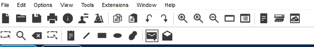

Your mouse pointer will turn into a `+` with an envelop next to it. Click that on `PC0` and then click `dns.cbrc.local`

In the bottom right hand corner of the screen you can see a new PDU for Scenario 0 has been created

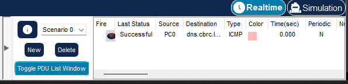. I'm going to move this up into the main window by clicking `Toggle PDU List Window`

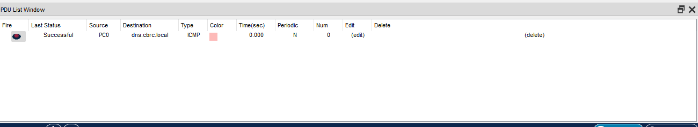


#### ADV PDUs

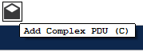

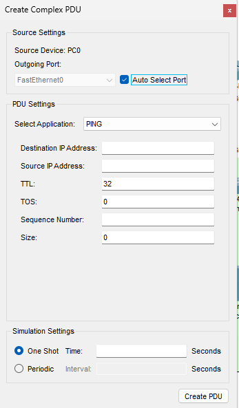

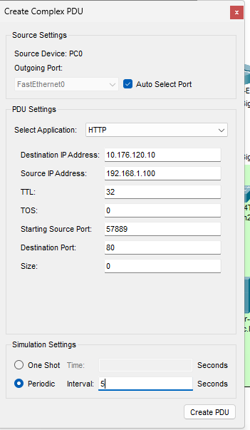

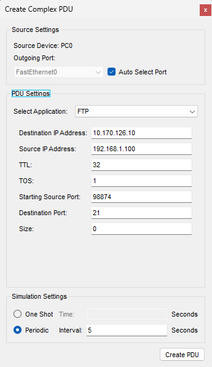

Let's go down to `dns.cbrc.local` and turn off FTP. Now, make a PDU to test FTP connectivity. 

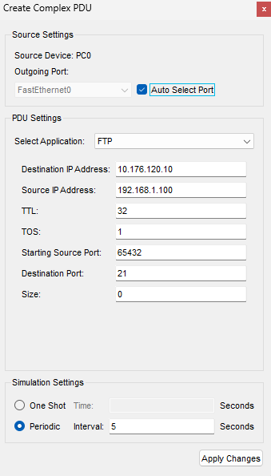

If you sit and watch it, you'll see it will fail and say in progress.

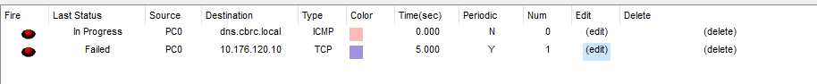

Let's enable FTP and see what happens:


### Scenarios

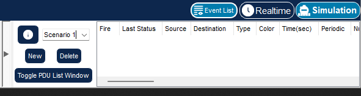


## Fluff about find out

*So, you've learnt lots of things so far today. I challenge you to use your imagination and try and find some things that you feel you might be able to do, but weren't necessarily taught.*

I'd like for you to make a new network. Make it 5 pronged: 


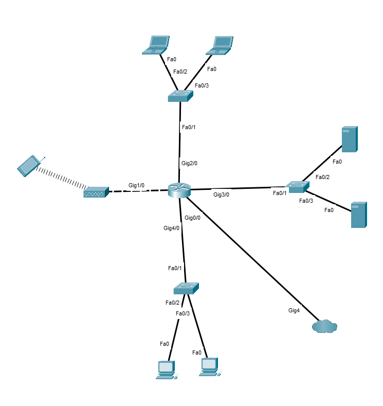


* A wireless access point
* A laptop connection area via switches
* Some PCs plugged into a different switch
* Some Servers plugged into a different switch: make one DNS and the other email. 
* The router plugged into a `PT-Empty` multiuser connection as the "internet"
* The router acts as the DHCP server
* Each prong of the network is a different IP range. Bragging points if you use a subnet :) 

Create the following PDUs to prove that the network works: 

Smart phone: 

* Create a simple PDU to reach the router
* Create a simple PDU to reach the internet 

One laptop: 

* Create a simple PDU to reach the router 
* Create a Complex PDU to test if email is working

One PC

* Create a complex PDU to test DHCP is working

