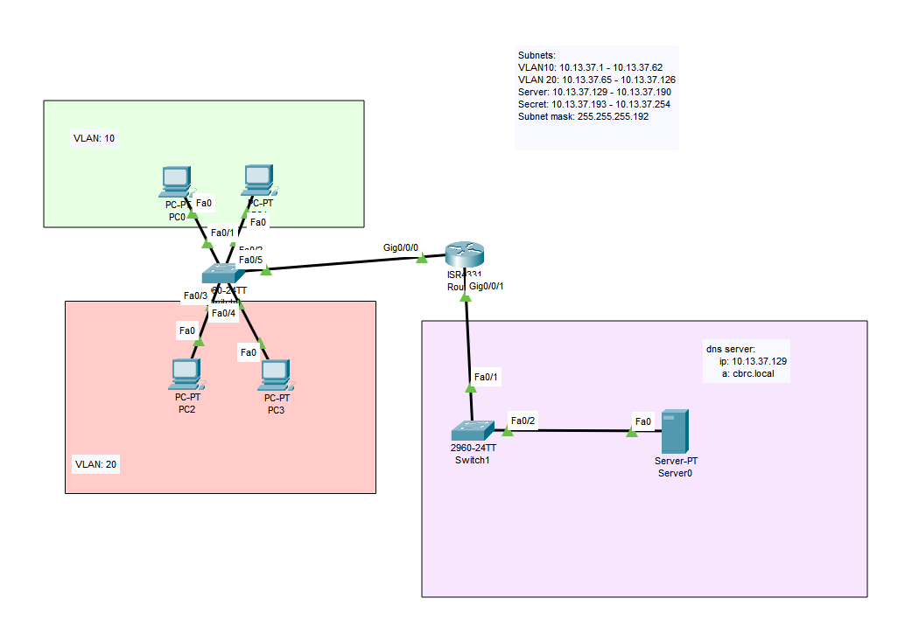

# Routers and VLANS

## Learning intentions and selection criterion

### Learning intentions

*What are we learning in this brief?*

### Selection criterion

*I will know I have learned this when I can:"

## Topic | Commands | Code

*It is important to practice commands | code and challenge our brain in new ways. Do all of the problems below, including the example problems. They will make you a better programmer | operator.*

### Example

## Practice Questions

### Practice

## Fluff about find out

So, you've learnt lots of things so far today. I challenge you to use your imagination and try and find some things that you feel you might be able to do, but weren't necessarily taught.

Because it's our first week, I am happy to give you some hints to start you off, but go nuts.

## Bug hunt

Kevin has written some code and it doesn't work. What's wrong with it?