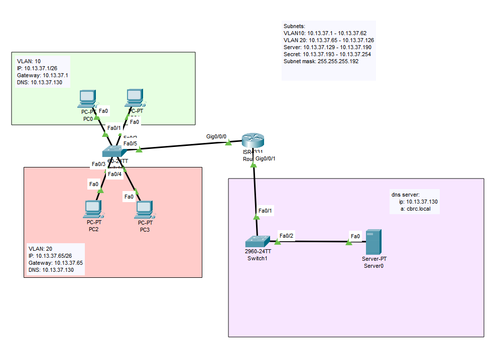

# Routers and VLANS

## Learning intentions and selection criterion

### Learning intentions

*What are we learning in this brief?*

### Selection criterion

*I will know I have learned this when I can:"

## Topic | Commands | Code

*It is important to practice commands | code and challenge our brain in new ways. Do all of the problems below, including the example problems. They will make you a better programmer | operator.*




```cmd
Router#enable
Router#configure terminal
Enter configuration commands, one per line.  End with CNTL/Z.
Router(config)#int g0/0/0
Router(config-if)#no shutdown
Router(config-if)#int g0/0/0.10
Router(config-subif)#encapsulation dot1q 10
Router(config-subif)#ip add 10.13.37.1 255.255.255.192
Router(config-subif)#int g0/0/0.20
Router(config-subif)#encapsulation dot1q 20
Router(config-subif)#ip add 10.13.37.65 255.255.255.192
Router(config-subif)#exit
Router(config)#ip dhcp pool TOP_NETWORK
Router(dhcp-config)#network 10.13.37.0 255.255.255.192
Router(dhcp-config)#default-router 10.13.37.1
Router(dhcp-config)#dns-server 10.13.37.130
Router(dhcp-config)#ip dhcp pool BOTTOM_NETWORK
Router(dhcp-config)#network 10.13.37.65 255.255.255.192
Router(dhcp-config)#default-router 10.13.37.65
Router(dhcp-config)#dns-server 10.13.37.130
Router(dhcp-config)#end
Router#
%SYS-5-CONFIG_I: Configured from console by console
configure terminal
Enter configuration commands, one per line.  End with CNTL/Z.
Router(config)#interface g0/0/1
Router(config-if)#ip address 10.13.37.129 255.255.255.192
Router(config-if)#no shutdown
Router(config-if)#end
Router#
%SYS-5-CONFIG_I: Configured from console by console
show ip int
Router#show ip interface brief
Interface              IP-Address      OK? Method Status                Protocol 
GigabitEthernet0/0/0   unassigned      YES unset  up                    up 
GigabitEthernet0/0/0.1010.13.37.1      YES manual up                    up 
GigabitEthernet0/0/0.2010.13.37.65     YES manual up                    up 
GigabitEthernet0/0/1   10.13.37.129    YES manual up                    up 
GigabitEthernet0/0/1.10unassigned      YES unset  up                    up 
GigabitEthernet0/0/2   unassigned      YES unset  administratively down down 
Vlan1                  unassigned      YES unset  administratively down down
```

PC0

```cmd
C:\>ipconfig

FastEthernet0 Connection:(default port)

   Connection-specific DNS Suffix..: 
   Link-local IPv6 Address.........: FE80::20C:85FF:FEA1:66A3
   IPv6 Address....................: ::
   IPv4 Address....................: 10.13.37.2
   Subnet Mask.....................: 255.255.255.192
   Default Gateway.................: ::
                                     10.13.37.1
```

```cmd
C:\>ping 10.13.37.2

Pinging 10.13.37.2 with 32 bytes of data:

Reply from 10.13.37.2: bytes=32 time=4ms TTL=128
Reply from 10.13.37.2: bytes=32 time=2ms TTL=128
Reply from 10.13.37.2: bytes=32 time=2ms TTL=128
Reply from 10.13.37.2: bytes=32 time=4ms TTL=128
```


```cmd
C:\>ping 10.13.37.1

Pinging 10.13.37.1 with 32 bytes of data:

Reply from 10.13.37.1: bytes=32 time<1ms TTL=255
Reply from 10.13.37.1: bytes=32 time<1ms TTL=255
Reply from 10.13.37.1: bytes=32 time<1ms TTL=255
Reply from 10.13.37.1: bytes=32 time<1ms TTL=255

Ping statistics for 10.13.37.1:
    Packets: Sent = 4, Received = 4, Lost = 0 (0% loss),
Approximate round trip times in milli-seconds:
    Minimum = 0ms, Maximum = 0ms, Average = 0ms
```

```cmd
C:\>ping 10.13.37.65

Pinging 10.13.37.65 with 32 bytes of data:

Reply from 10.13.37.65: bytes=32 time<1ms TTL=255
Reply from 10.13.37.65: bytes=32 time<1ms TTL=255
Reply from 10.13.37.65: bytes=32 time<1ms TTL=255
Reply from 10.13.37.65: bytes=32 time<1ms TTL=255
```

```cmd

C:\>ping 10.13.37.130

Pinging 10.13.37.130 with 32 bytes of data:

Reply from 10.13.37.130: bytes=32 time=8ms TTL=127
Reply from 10.13.37.130: bytes=32 time<1ms TTL=127
Reply from 10.13.37.130: bytes=32 time<1ms TTL=127
Reply from 10.13.37.130: bytes=32 time<1ms TTL=127
```

### Example

## Practice Questions

### Practice

## Fluff about find out

So, you've learnt lots of things so far today. I challenge you to use your imagination and try and find some things that you feel you might be able to do, but weren't necessarily taught.

Because it's our first week, I am happy to give you some hints to start you off, but go nuts.

## Bug hunt

Kevin has written some code and it doesn't work. What's wrong with it?