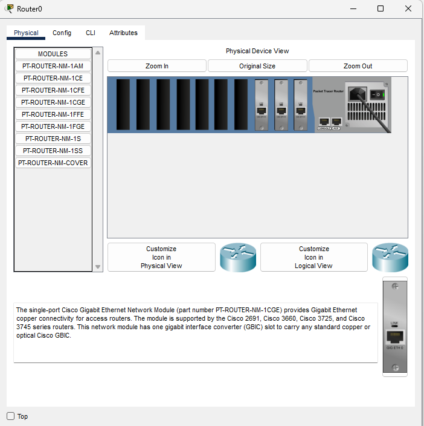

# Access Lists

## Learning intentions and selection criterion

### Learning intentions

*What are we learning in this brief?*

### Selection criterion

*I will know I have learned this when I can:"

## Topic | Commands | Code

*It is important to practice commands | code and challenge our brain in new ways. Do all of the problems below, including the example problems. They will make you a better programmer | operator.*

### Example



```cmd
Router>enable
Router#configure terminal
Router(config)#interface g0/0
Router(config-if)#ip address 10.13.37.1 255.255.255.0
Router(config-if)#no shutdown
Router(config-if)#interface g1/0
Router(config-if)#ip address 192.168.1.1 255.255.255.0
Router(config-if)#no shutdown
Router(config-if)#interface g2/0
Router(config-if)#ip address 203.192.168.1 255.255.255.0
Router(config-if)#no shutdown

```


```cmd
Router#configure terminal
Router(config)#ip access-list standard BlockTop
Router(config-std-nacl)#deny 10.13.37.0 0.0.0.255
Router(config-std-nacl)#permit any
Router(config-std-nacl)#exit
Router(config)#interface g2/0
Router(config-if)#ip access-group BlockTop out
Router(config-if)#exit
Router(config)#end
```

```cmd
C:\>ipconfig

FastEthernet0 Connection:(default port)

   Connection-specific DNS Suffix..: 
   Link-local IPv6 Address.........: FE80::201:C7FF:FE99:1BB1
   IPv6 Address....................: ::
   IPv4 Address....................: 192.168.1.100
   Subnet Mask.....................: 255.255.255.0
   Default Gateway.................: ::
                                     192.168.1.1
```

```cmd
C:\>ping 192.168.1.100

Pinging 192.168.1.100 with 32 bytes of data:

Reply from 192.168.1.100: bytes=32 time=5ms TTL=128
Reply from 192.168.1.100: bytes=32 time=3ms TTL=128
Reply from 192.168.1.100: bytes=32 time=4ms TTL=128
Reply from 192.168.1.100: bytes=32 time=2ms TTL=128

Ping statistics for 192.168.1.100:
    Packets: Sent = 4, Received = 4, Lost = 0 (0% loss),
Approximate round trip times in milli-seconds:
    Minimum = 2ms, Maximum = 5ms, Average = 3ms

```

```cmd
C:\>ping 192.168.1.1

Pinging 192.168.1.1 with 32 bytes of data:

Reply from 192.168.1.1: bytes=32 time<1ms TTL=255
Reply from 192.168.1.1: bytes=32 time<1ms TTL=255
Reply from 192.168.1.1: bytes=32 time<1ms TTL=255
Reply from 192.168.1.1: bytes=32 time<1ms TTL=255

Ping statistics for 192.168.1.1:
    Packets: Sent = 4, Received = 4, Lost = 0 (0% loss),
Approximate round trip times in milli-seconds:
    Minimum = 0ms, Maximum = 0ms, Average = 0ms

```

```cmd
C:\>ping 10.13.37.1

Pinging 10.13.37.1 with 32 bytes of data:

Reply from 10.13.37.1: bytes=32 time<1ms TTL=255
Reply from 10.13.37.1: bytes=32 time<1ms TTL=255
Reply from 10.13.37.1: bytes=32 time<1ms TTL=255
Reply from 10.13.37.1: bytes=32 time<1ms TTL=255

Ping statistics for 10.13.37.1:
    Packets: Sent = 4, Received = 4, Lost = 0 (0% loss),
Approximate round trip times in milli-seconds:
    Minimum = 0ms, Maximum = 0ms, Average = 0ms

```

```terminal
C:\>ping 203.192.168.100

Pinging 203.192.168.100 with 32 bytes of data:

Request timed out.
Reply from 203.192.168.100: bytes=32 time<1ms TTL=127
Reply from 203.192.168.100: bytes=32 time<1ms TTL=127
Reply from 203.192.168.100: bytes=32 time<1ms TTL=127

Ping statistics for 203.192.168.100:
    Packets: Sent = 4, Received = 3, Lost = 1 (25% loss),
Approximate round trip times in milli-seconds:
    Minimum = 0ms, Maximum = 0ms, Average = 0ms

```

Let's test on the top network: 

```terminal
Cisco Packet Tracer PC Command Line 1.0
C:\>ping 10.13.37.1

Pinging 10.13.37.1 with 32 bytes of data:

Reply from 10.13.37.1: bytes=32 time<1ms TTL=255
Reply from 10.13.37.1: bytes=32 time<1ms TTL=255
Reply from 10.13.37.1: bytes=32 time<1ms TTL=255
Reply from 10.13.37.1: bytes=32 time<1ms TTL=255

Ping statistics for 10.13.37.1:
    Packets: Sent = 4, Received = 4, Lost = 0 (0% loss),
Approximate round trip times in milli-seconds:
    Minimum = 0ms, Maximum = 0ms, Average = 0ms

C:\>ping 203.192.168.1

Pinging 203.192.168.1 with 32 bytes of data:

Reply from 203.192.168.1: bytes=32 time<1ms TTL=255
Reply from 203.192.168.1: bytes=32 time<1ms TTL=255
Reply from 203.192.168.1: bytes=32 time<1ms TTL=255
Reply from 203.192.168.1: bytes=32 time<1ms TTL=255

Ping statistics for 203.192.168.1:
    Packets: Sent = 4, Received = 4, Lost = 0 (0% loss),
Approximate round trip times in milli-seconds:
    Minimum = 0ms, Maximum = 0ms, Average = 0ms

C:\>ping 203.192.168.100

Pinging 203.192.168.100 with 32 bytes of data:

Reply from 10.13.37.1: Destination host unreachable.
Reply from 10.13.37.1: Destination host unreachable.
Reply from 10.13.37.1: Destination host unreachable.
Reply from 10.13.37.1: Destination host unreachable.

Ping statistics for 203.192.168.100:
    Packets: Sent = 4, Received = 0, Lost = 4 (100% loss),

```

### Practice

## Fluff about find out

So, you've learnt lots of things so far today. I challenge you to use your imagination and try and find some things that you feel you might be able to do, but weren't necessarily taught.

Challenge: Incorporate this with lab.5.3

