# Configuring DNS - Domain Name Services 

## Objectives 

### What is DNS? 

* https://www.cloudflare.com/en-gb/learning/dns/what-is-dns/

### Technical Purpose

The objective of this lab is to configure a DNS entry on a generic server and then test it from a host device. 

## Lab

### Lab Topology 

Use the following topology to complete this lab exercise. 

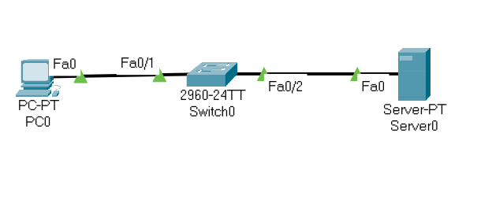

Question: What do you think topology means in the context of Computer Networking (hint, exams like these kinds of questions)

### Setting up network: 

* Find the generic host PC and server and put it on the work canvas. 
* Find a CISCO switch and put that on the canvas
* Find a generic server and add that to the canvas
* connect both PC and Server to the switch (use any Ethernet ports)

### Configure PC: 
* Configure the PC IP address to 192.168.1.5

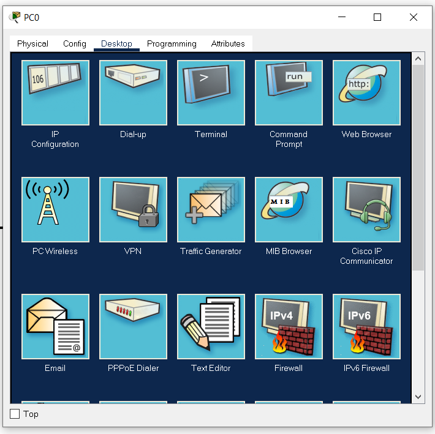

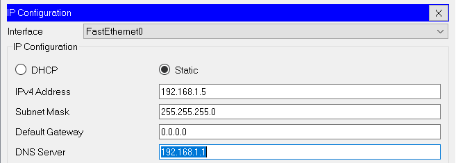

### Configure Server
* Configure the Server IP address to 192.168.1.1

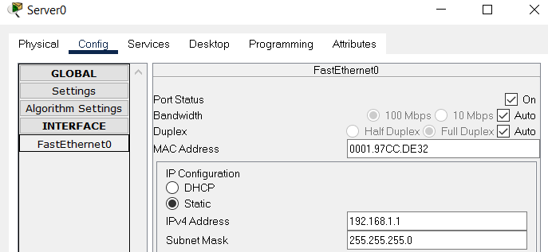

### Ping the server from the PC

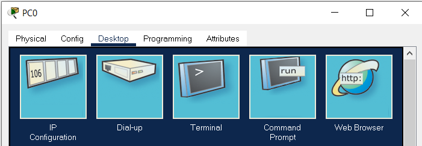

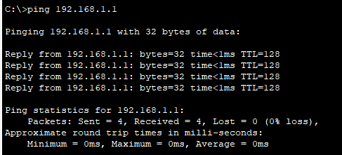

### Test if DNS works (it won't)

Test on the PC if you can reach the web URL `www.cbrc.edu`

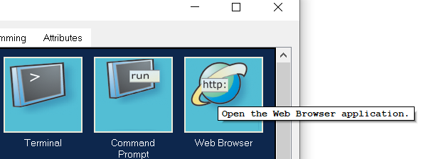

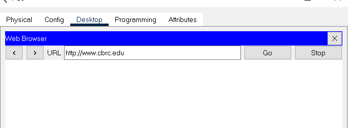

### Configure DNS entry on server

To create a DNS record on the server for this URL we need to: 

* GO to the DNS Services on the server 
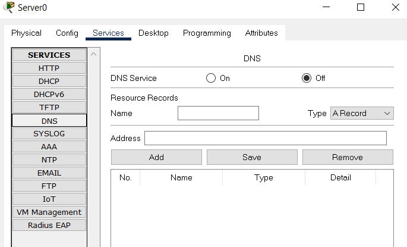

* Add the URL `www.cbrc.edu` 
* As an A record
* Ensure that DNS is turned on
  
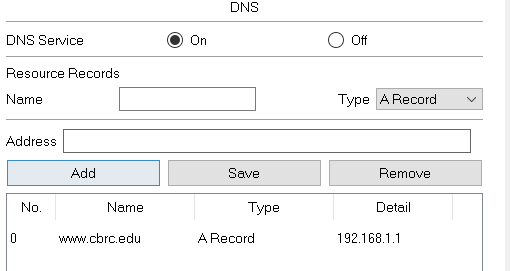

Question: What is an A record? 

### Test if webpage works on PC

Using the web browser on the PC enter the address `www.cbrc.edu`

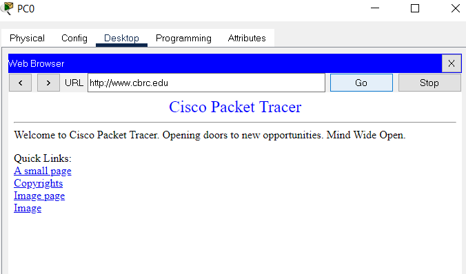
