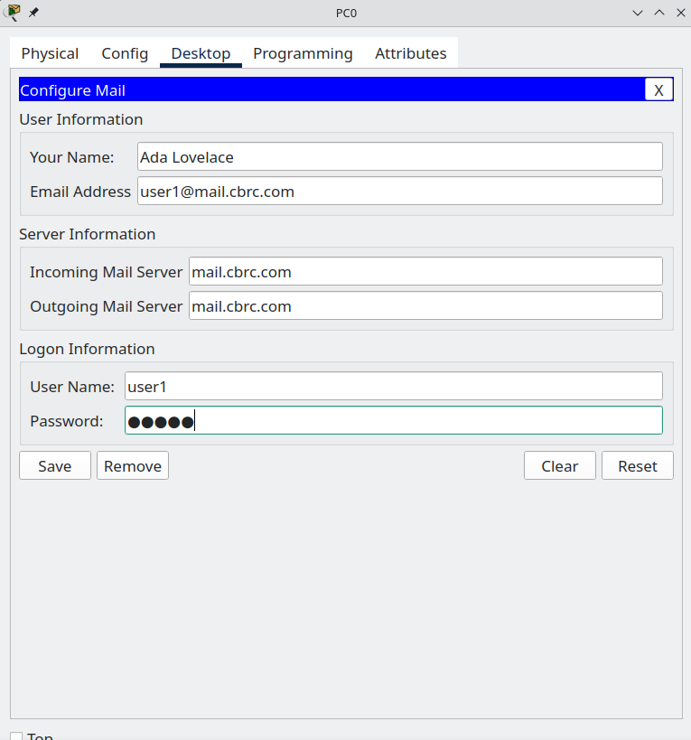

# Common Services: email 

## Learning intentions 

What are we learning?

* know what email is
* understanding how to configure and enable email servers on a system 

## Selection Criteria 

How will you know you have learned the stuff that you need to learn? 

* You will know what email is. 
* You will know how to configure email services in packet tracer
* You will know how to set up email accounts 
* You will know how to send and receive an email in packet tracer.

## Email

### What is email? 

Email, short for electronic mail, is a digital method of exchanging messages between individuals or groups using internet services. It operates through a system of specialized servers that send, receive, and store these messages. A typical email journey starts with the user's client software composing the message, which is then packetised and sent to the SMTP (Simple Mail Transfer Protocol) server. This server finds the recipient's domain via DNS (Domain Name System) and forwards the packets there. Once the email arrives, the recipient server, usually a POP3 or IMAP server, stores the message until the recipient requests it. The email system represents a fundamental application of computer networking, where data in the form of messages are relayed across interconnected networks using specific protocols. Packet Tracer can be used to simulate and visualize this process, allowing for a deeper understanding of email operations.

### Lab

## Initial set up 

Set up the following network: 

### Server0

Inital config

Turn DHCP on 

Turn DNS on and add records for cbrc.com and mail.cbrc.com

### PC0

Turn DHCP on 

## Email 

Email already starts turned on: 

### What is SMTP? 

SMTP, or Simple Mail Transfer Protocol, is a set of rules for sending emails over the internet. It functions like a post office, routing and delivering messages from the sender's email client to the recipient's mail server. SMTP doesn't retrieve mail from servers or mailboxes, it only sends them. It works closely with protocols like IMAP or POP3, which are used for receiving and storing messages. Its functionality can be studied and simulated using tools like Packet Tracer to gain a deeper understanding of its role in email communication.

### What is POP3? 

POP3, short for Post Office Protocol version 3, is an internet standard protocol used by local email clients to retrieve mail from a remote server over a TCP/IP connection. Unlike SMTP, which sends messages, POP3 is used for receiving emails. When you check your inbox, your email client connects to the mail server using POP3, downloads all your emails to your local system, and then typically deletes them from the server. It's a simple, widely-used protocol that is ideal for users who access their email from a single device.

### What is IMAP?

IMAP, or Internet Message Access Protocol, is a standard email protocol that stores messages on a mail server and enables the end user to view and manipulate the messages as though they were stored locally on their device(s). Unlike POP3, which downloads and typically deletes emails from the server, IMAP allows users to access their email from multiple devices, and actions like reading, deleting, or moving emails are synchronized with the server. This makes it a flexible solution for people who need to access their email on different devices or locations.

This feature is not enabled on packet tracer. 

### Configuring email

* Add the domain name `mail.cbrc.com` to the section that asks you to. Then click add. 
* Add usernames and passwords to the users below. Make sure to click the little `+` to add them to the system

## Email on PC0

Go back to PC0 and open up the desktop tool. 

Click on email.

Now fill out each item for a user

Now send yourself an email! Click compose and 

## Challenge: 

Create the following network. Ensure that both Ada and Bob can email each other. 

