# Command Services: Email

## Learning intentions

What are we learning? 

* Know what FTP is
* Understand how to configure and enable ftp servers on a system

## Selection Criteria


## FTP

## What is FTP?

FTP (File Transfer Protocol) is a standard network protocol used for transferring files from one host to another over a TCP-based network, such as the internet. It works in a client-server architecture, where a client makes a connection to the server to download or upload files. FTP employs two separate connections for control (commands) and data to ensure secure and reliable transmission. In Packet Tracer, an educational tool for network simulation, you can simulate FTP transactions, viewing packet-level details for a clear understanding of FTP communication and file transfer. Understanding FTP is essential in networking as it is foundational for many internet services and applications.

## Common FTP commands


1. `ftp <hostname/ip>`: This command is used to connect to an FTP server. Replace `<hostname/ip>` with the hostname or IP address of the FTP server.

2. `user <username>`: This command is used to log in with a specific username. Replace `<username>` with your actual username.

3. `pass <password>`: This command is used to provide the password for the previously entered username. Replace `<password>` with your actual password.

4. `ls`: This command is used to list the files and directories in the current directory on the FTP server.

5. `cd <directory>`: This command changes the current directory on the FTP server. Replace `<directory>` with the name of the directory you want to change to.

6. `get <filename>`: This command downloads a file from the FTP server to the local system. Replace `<filename>` with the name of the file you want to download.

7. `put <filename>`: This command uploads a file from your local system to the FTP server. Replace `<filename>` with the name of the file you want to upload.

8. `quit`: This command is used to log out from the FTP server and terminate the FTP session.

Remember to replace the placeholders `<hostname/ip>`, `<username>`, `<password>`, `<directory>`, and `<filename>` with the actual values as per your setup and requirement.


## lab

Set up the following network: 

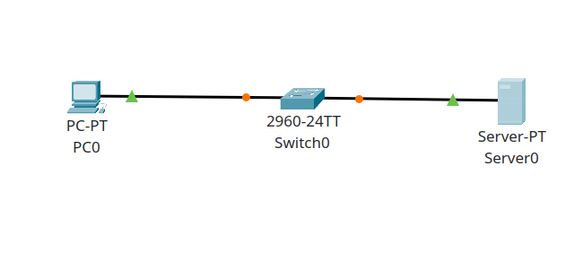

### Server0

The server is going to have all aspects of the services on board. 

DHCP: 

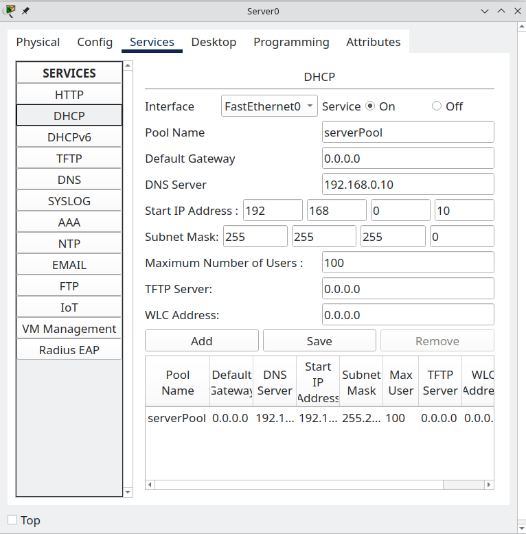

DNS

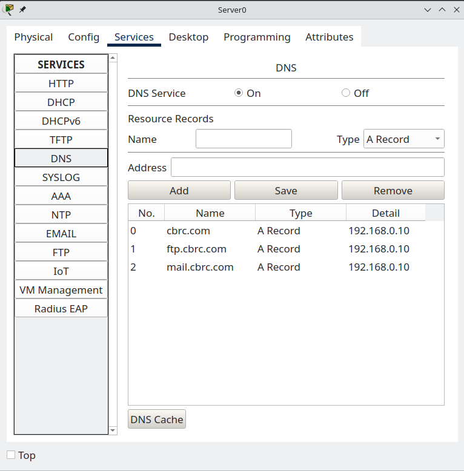


FTP

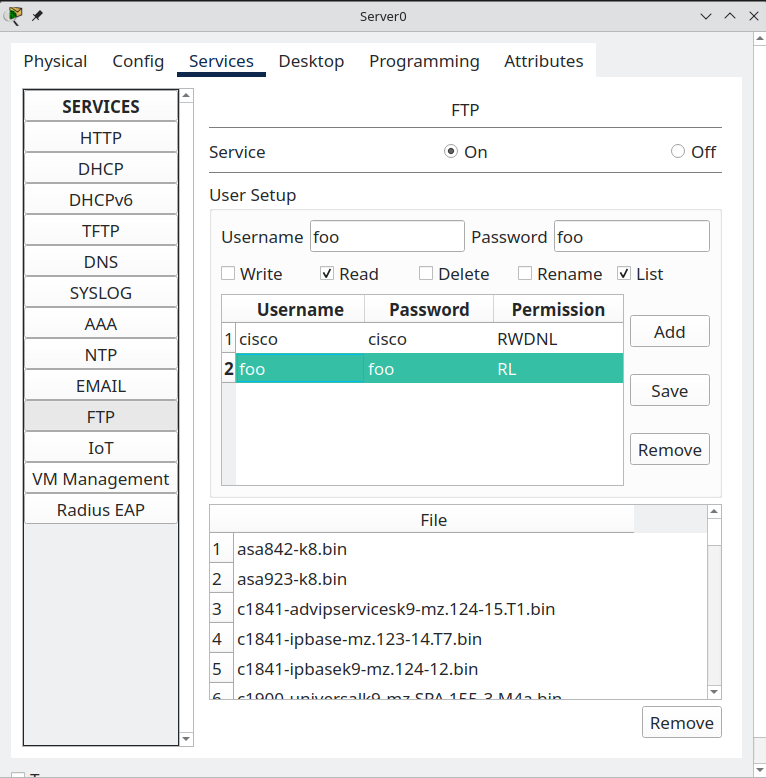


### PC0

Before we connect to the FTP server, let's check out what is on our local directory. Ignore the shenanigans with all the carriage returns. 

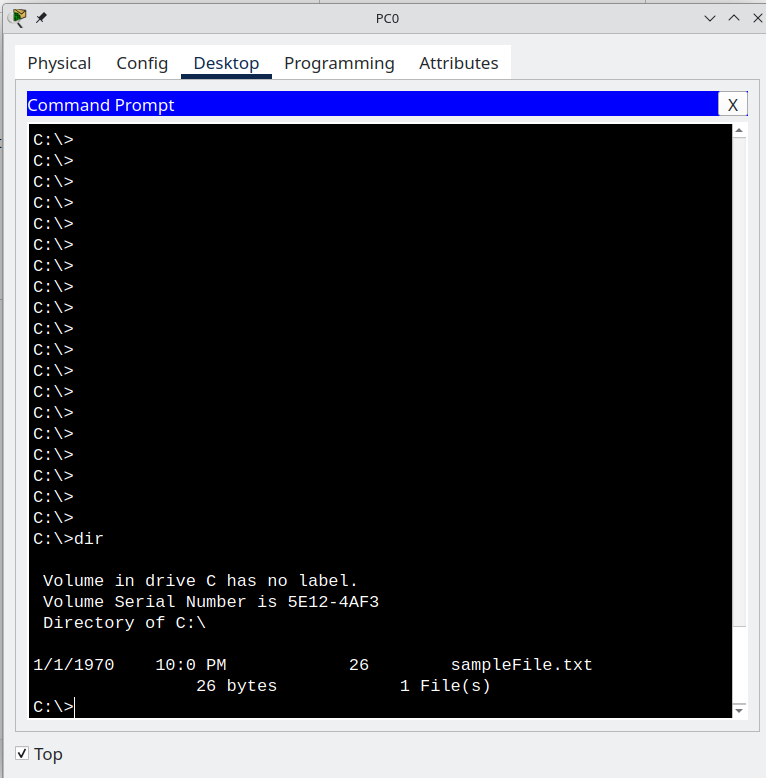

#### Connecting to FTP

To connect to FTP we type `ftp ftp.cbrc.com` and for user:password we use what use plugged into the ftp server setup. 

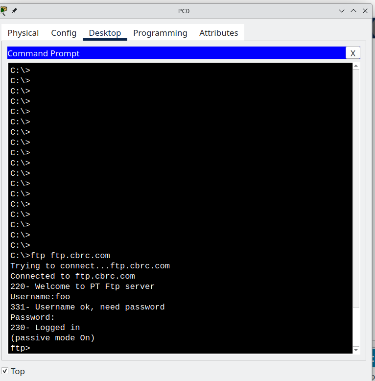

Once we log into the system, let's see what the commands are by typing `help`. 

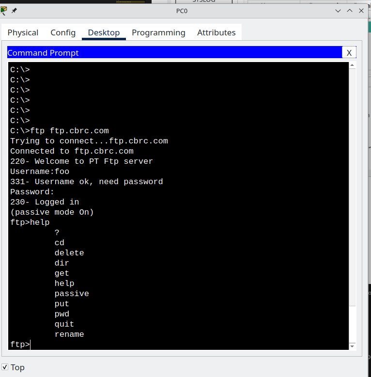

So, we have a bunch of commands that we can use. I want to see what is on the server so let's type `dir` for directory.

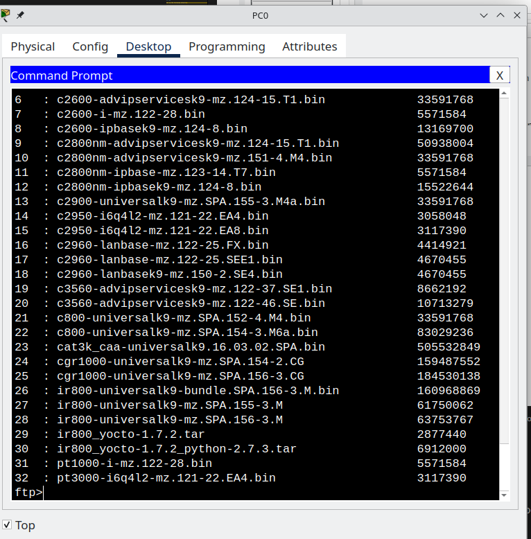

Okay, that looks good. File 29, ir800_yocto-1.7.2.tar looks like a good candidate to download because it's only 2.8 meg. 

Let's `get` it. 

```bash
get ir800_yocto-1.7.2.tar
```

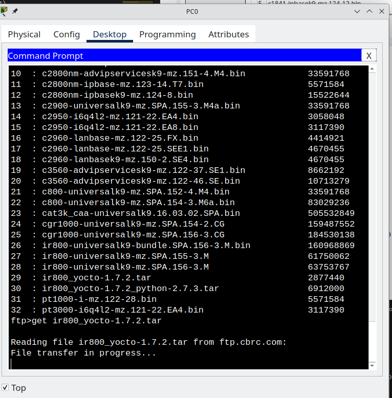

It's going to take a while. I guess it thinks we're on dial up ;)

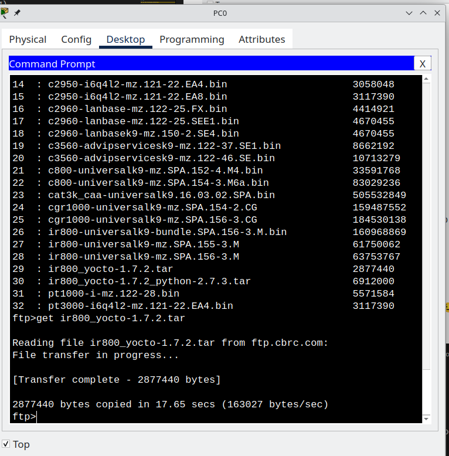


Let's disconnect from the server with `quit`. 

Let's check the local directory of PC0

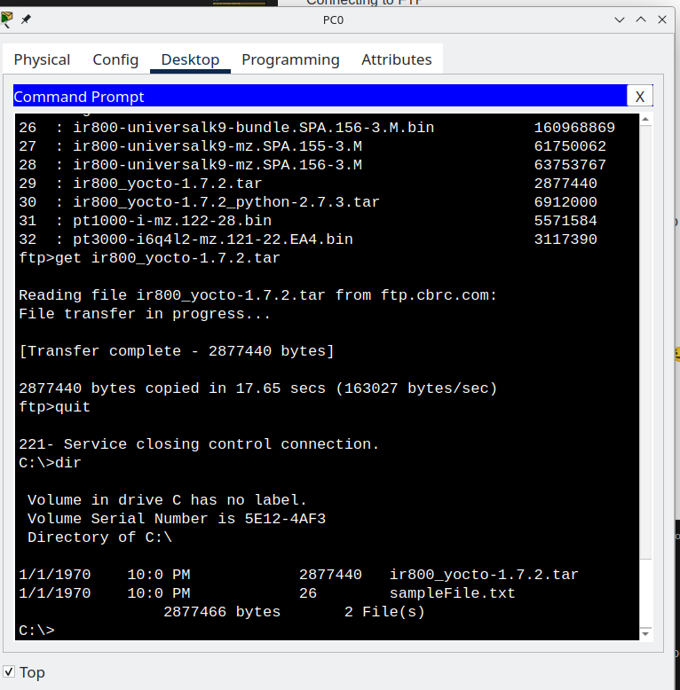

Two things stand out to me: 

* The file we downloaded is there and it looks complete. 
* There is another file there! 

Let's upload it!

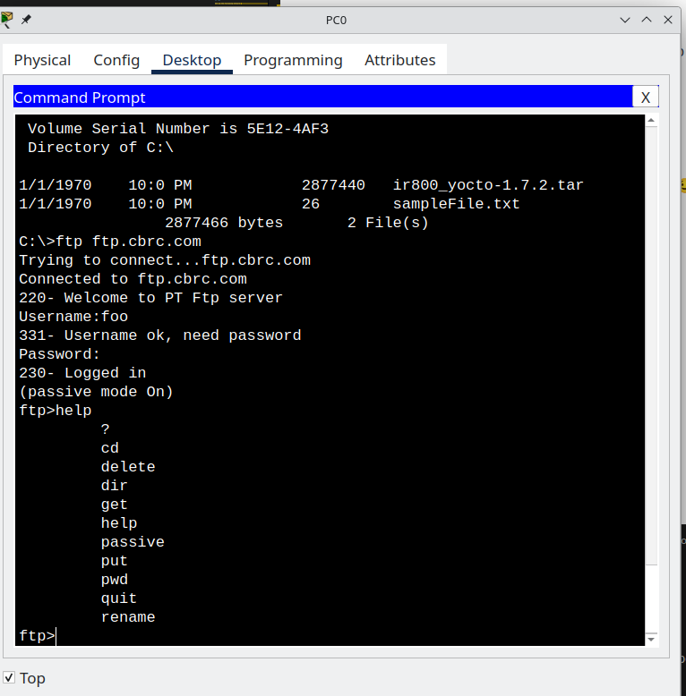

To upload it, we need to use the `put` command. 

So let's do that. Type 

`put sampleFile.txt` in there and see what happens....


Oh oh ... 

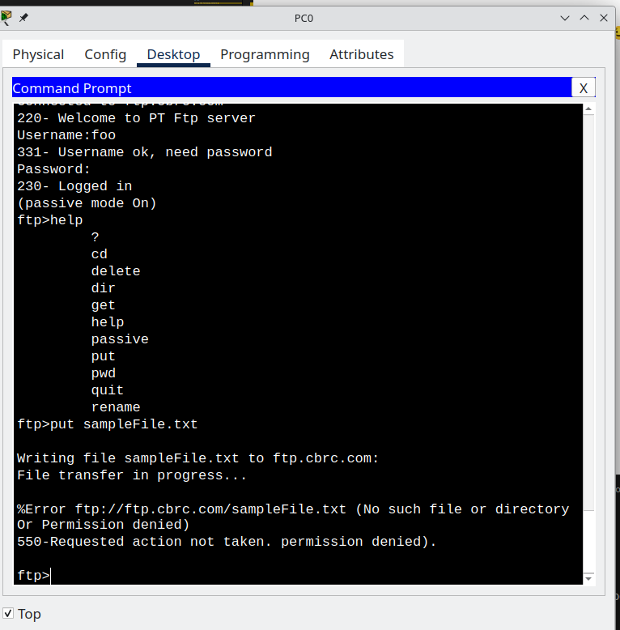

What went wrong? 

```bash
%Error ftp://ftp.cbrc.com/sampleFile.txt (No such file or directory Or Permission denied)
550-Requested action not taken. permission denied).
```

Why is that? It's because we didn't set up foo with permissions to upload/write. 

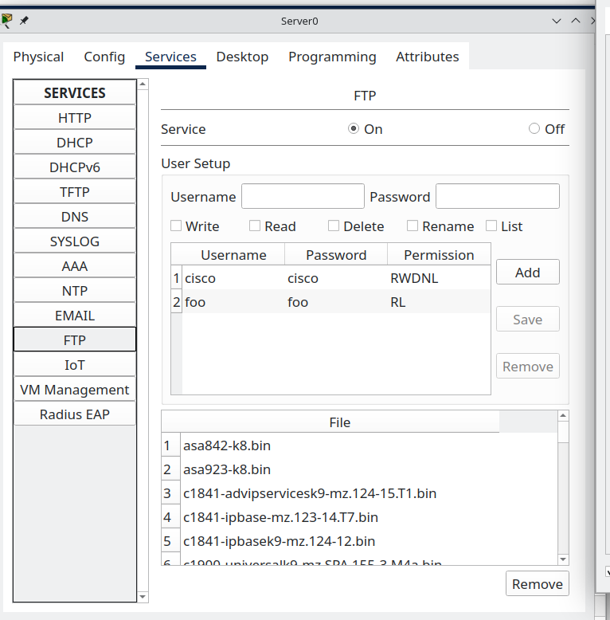

See how the `foo` user only has the `RL` permissions? That means all they can do is `READ` and `LIST`. We have two choices, we can use the cisco:cisco account or we can modify foo:foo to have more permissions. Let's do the latter

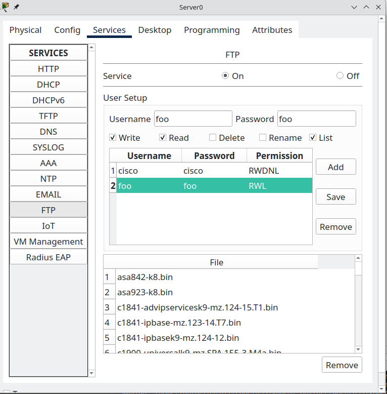

Now try again: 

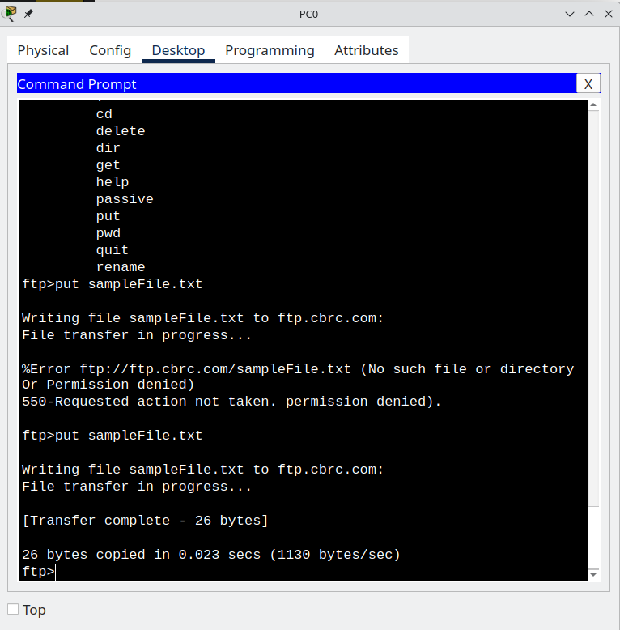