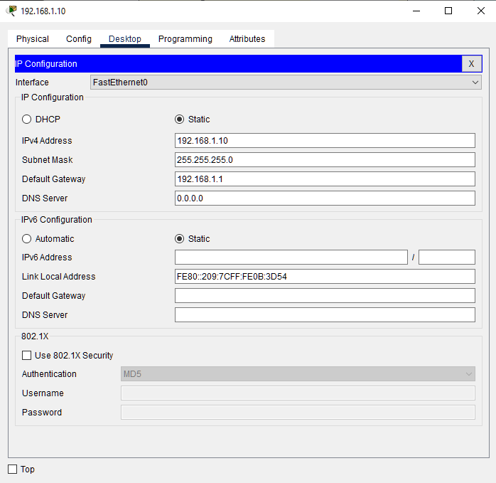
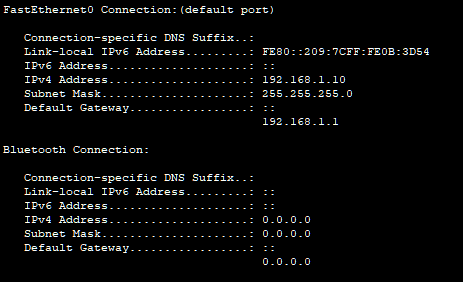
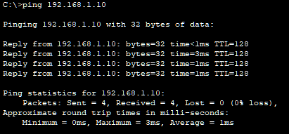
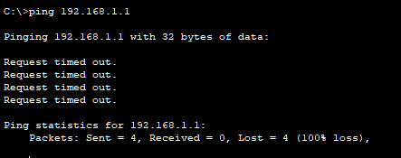
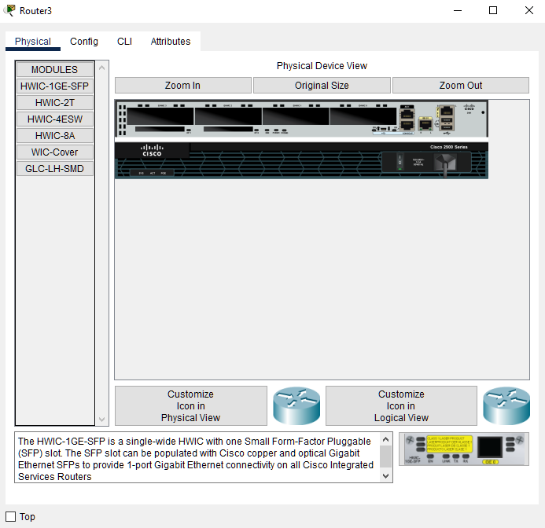
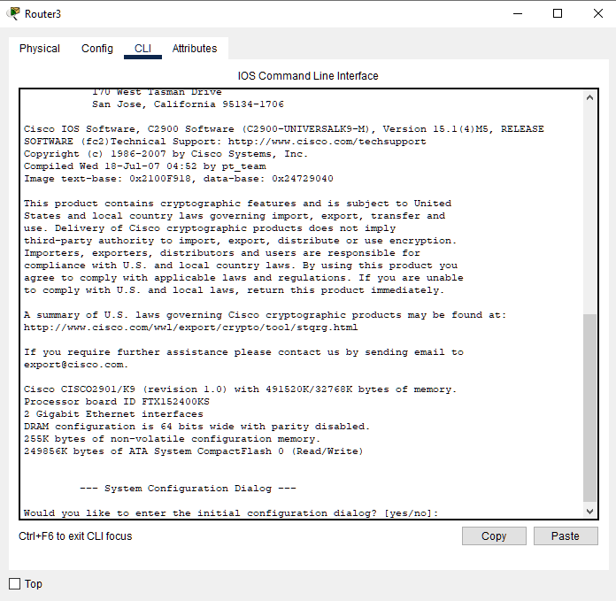
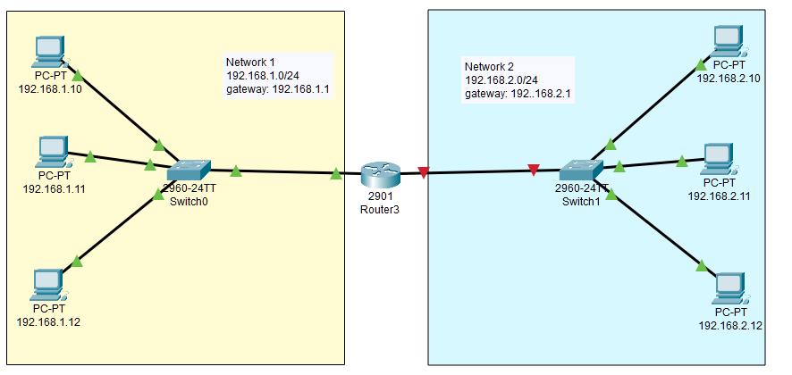
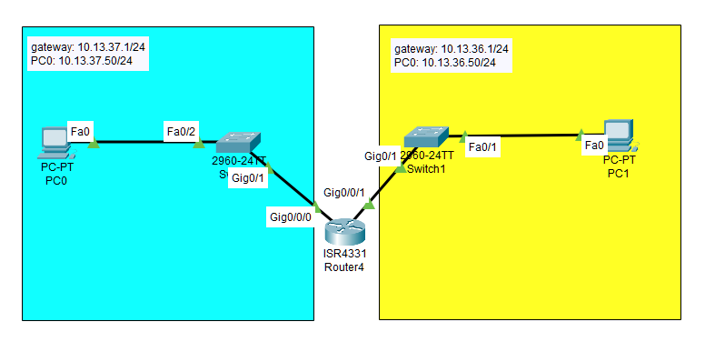

# Routing between two networks

How do we access two different networks via a router? 


**original author:** [someone](https://github.com/someone)

<!-- add a new author mark if you updated this -->

## Topics covered

"At the end of this recipe, you will be able to answer the following questions or solve the following problems"

<!-- why should people expect to be able to do or know after doing this recipe -->

* How do you enable routing between two networks?

### Things you'll need to know before you start this

<!-- what should they know before learning it -->

* How to configure simple routers (we used SSH)

## Topics

### Introduction

<!-- Introduce the topic, what is it, how does it work, include pictures -->

We've looked a VLANs and we've created a simple routed network. However, learning how to route more complex networks is an essential part of your journey into creating larger more complex networks. 

#### Understanding the network to be designed

This lab requires you to configure two rooms. Each room has 3 PCs and a switch connected by a single router.


Network 1 is to use the following configurations

* subnet: 192.168.1.0/24
* gateway: 192.168.1.1
* PC1: 192.168.1.10
* PC2: 192.168.1.11
* PC3: 192.168.1.12

Network 2 is to use the following configurations

* subnet: 192.168.2.0/24
* gateway: 192.168.2.1
* PC1: 192.168.2.10
* PC2: 192.168.2.11
* PC3: 192.168.2.12

Router configuration 

* g0/0 192.168.1.1
* g0/1 192.168.2.1

## Worked Examples

<!-- Provide some basic worked examples that let people follow your worked examples. If it's a library, don't forget to tell people how to install it -->

### Configuring PCs

Click on each PC and open up to Desktop mode. 


Open the IP Configuration panel and configure the network



Repeat this process for each PC in both networks using the appropriate IP addresses. 

### Test subnets

Click on a PC and go back to to the Desktop (I chose `192.168.1.10`)


Click on Command Prompt

Type `ipconfig`



Ping the address shown on this device



Test the gateway (this shouldn't work)



### Configure the router for Network 1

Click on the router



Go to CLI mode



```bash
Would you like to enter the initial configuration dialog? [yes/no]: no


Press RETURN to get started!


Router>enable
Router#configure terminal
Enter configuration commands, one per line.  End with CNTL/Z.
Router(config)#interface g0/0
Router(config-if)#ip address 192.168.1.1 255.255.255.0
Router(config-if)#no shutdown

Router(config-if)#
%LINK-5-CHANGED: Interface GigabitEthernet0/0, changed state to up

%LINEPROTO-5-UPDOWN: Line protocol on Interface GigabitEthernet0/0, changed state to up
Router(config)#end
%SYS-5-CONFIG_I: Configured from console by console

Router#show ip interface brief
Interface              IP-Address      OK? Method Status                Protocol 
GigabitEthernet0/0     192.168.1.1     YES manual up                    up 
GigabitEthernet0/1     unassigned      YES unset  administratively down down 
Vlan1                  unassigned      YES unset  administratively down down

```

Network 1 should be enabled



Let's ping ourselves 

```bash
Router#ping 192.168.1.1

Type escape sequence to abort.
Sending 5, 100-byte ICMP Echos to 192.168.1.1, timeout is 2 seconds:
!!!!!
Success rate is 100 percent (5/5), round-trip min/avg/max = 0/2/4 ms
```

Let's ping one of the computers on this subnet

```bash
Router#ping 192.168.1.10

Type escape sequence to abort.
Sending 5, 100-byte ICMP Echos to 192.168.1.10, timeout is 2 seconds:
.!!!!
Success rate is 80 percent (4/5), round-trip min/avg/max = 0/0/0 ms
```

Remember, that first failure is due to the routing pathway being created for the first time. 


### Testing network 1 PC to Router

Open up to desktop 


Click on `command prompt`

type `ping 192.168.1.1`

```bash
C:\>ping 192.168.1.1

Pinging 192.168.1.1 with 32 bytes of data:

Reply from 192.168.1.1: bytes=32 time<1ms TTL=255
Reply from 192.168.1.1: bytes=32 time<1ms TTL=255
Reply from 192.168.1.1: bytes=32 time<1ms TTL=255
Reply from 192.168.1.1: bytes=32 time<1ms TTL=255

Ping statistics for 192.168.1.1:
    Packets: Sent = 4, Received = 4, Lost = 0 (0% loss),
Approximate round trip times in milli-seconds:
    Minimum = 0ms, Maximum = 0ms, Average = 0ms
```


## Practice Questions

<!-- Provide some basic practice questions that let people follow your worked examples.  -->

Configure newtork 2 to connect and route to the network.

## Final Test

<!-- Make up a challenge question which asks people to use all of their knowledge they just learnt (and maybe some prior learning) to solve -->

Test that `192.168.1.10` can ping `192.168.2.10`


## Challenge 

Create the following network

