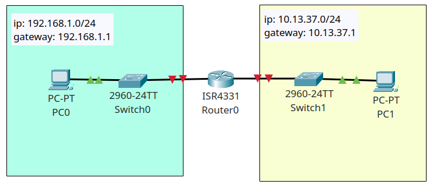

# Configuring a router to be the DHCP server

## Goals 

### Learning Intentions

### Selection Criteria

## Topics 

### Initial Network

Let's start by creating a simple network. We need: 

* 1x router. I don't think it really matters which one as long as it has a CLI and two G network ports
* 2x switches. It shouldn't matter which one. 
* 2x PCs


We're going to design the network so the left network will have the IP range of `192.168.1.0/24` and the right network will use `10.13.37.0/24`




## Initial router configuration

Open your router and go to CLI. 

I've gotten it to the stage where we have enabled and preparing to configure the terminal. 

```bash
Would you like to enter the initial configuration dialog? [yes/no]: no


Press RETURN to get started!


Router>enable
Router#configure terminal
Enter configuration commands, one per line.  End with CNTL/Z.
Router(config)#
Router#
```

### Configure ports

Let's hop on a port.

```bash
Router>show ip interface brief 
Interface              IP-Address      OK? Method Status                Protocol 
GigabitEthernet0/0/0   unassigned      YES unset  administratively down down 
GigabitEthernet0/0/1   unassigned      YES unset  administratively down down 
GigabitEthernet0/0/2   unassigned      YES unset  administratively down down 
Vlan1                  unassigned      YES unset  administratively down down
```

Okay, so I have 3 Gb ports available to me and I know that the left network is on G0/0/0  


Let's configure g0/0/0 to be the gateway for `192.168.1.0/24` in this case we are using `192.168.1.1`. Then, we will configure it to be the DHCP server for that network. 

### Revisiting setting router as a gateway

```bash
Router>enable
Router#configure terminal
Enter configuration commands, one per line.  End with CNTL/Z.
Router(config)#interface g0/0/0
Router(config-if)#ip address 192.168.1.1 255.255.255.0
Router(config-if)#no shutdown
exit
```


### Setting up DHCP on the router 


```bash
Router#configure terminal
Enter configuration commands, one per line.  End with CNTL/Z.
Router(config)#ip dhcp pool LEFT_NETWORK
Router(dhcp-config)#network 192.168.1.0 255.255.255.0
Router(dhcp-config)#default-router 192.168.1.1
Router(dhcp-config)#dns-server 10.176.120.10
Router(dhcp-config)#exit
```

WAIT: Before we go into the PC settings and turn on the dhcp.client breath and wait a bit. 

If we turn the PC on now, it will pick any IP address between 1 and 254. We don't want that, we want to reserve some IP ranges. 

Now we could have manually limited that above but we can also exclude some specific numbers from the range: 


### DHCP exclude

```bash
Router#configure terminal
Enter configuration commands, one per line.  End with CNTL/Z.
Router(config)#ip dhcp excluded-address 192.168.1.1 192.168.1.99
Router(config)# ip dhcp exclude-address 192.168.1.1 192.168.200.254
```

### Seeing what you've done

```bash
Router#show ip dhcp pool 

Pool LEFT_NETWORK :
 Utilization mark (high/low)    : 100 / 0
 Subnet size (first/next)       : 0 / 0 
 Total addresses                : 254
 Leased addresses               : 0
 Excluded addresses             : 1
 Pending event                  : none

 1 subnet is currently in the pool
 Current index        IP address range                    Leased/Excluded/Total
 192.168.1.1          192.168.1.1      - 192.168.1.254     0    / 1     / 254
 ```

 What about our excluded range? 

 ```bash
Router#show run | in exclude
ip dhcp excluded-address 192.168.1.1 192.168.1.99
ip dhcp excluded-address 192.168.1.200 192.168.1.254
```

### DHCP.client

Hop on to the PC over on the left network and turn on DHCP


Magic!

## Hey, what about that DNS server? 

Before that, let's delete that router, and put a PT-Empty router on the screen. This gives us more power. 

Once we get on, turn it off, and slot 3 PT-ROUTER-NM-CGE adaptors into the slot. This gives us 3 Gb interfaces to play with. 

Turn the router back on and connect it to the following network. 


Let's quickly config g0/0

```bash
Router>enable
Router#show ip interface brief
Interface              IP-Address      OK? Method Status                Protocol 
GigabitEthernet0/0     unassigned      YES unset  administratively down down 
GigabitEthernet1/0     unassigned      YES unset  administratively down down 
GigabitEthernet2/0     unassigned      YES unset  administratively down down
Router#configure terminal
Enter configuration commands, one per line.  End with CNTL/Z.
Router(config)#interface g0/0
Router(config-if)#ip address 192.168.1.1 255.255.255.0
Router(config-if)#no shutdown

Router(config-if)#
%LINK-5-CHANGED: Interface GigabitEthernet0/0, changed state to up

%LINEPROTO-5-UPDOWN: Line protocol on Interface GigabitEthernet0/0, changed state to up
exit
Router(config)#end
Router#
%SYS-5-CONFIG_I: Configured from console by console
Router(config)#ip dhcp pool LEFT_NETWORK
Router(dhcp-config)#network 192.168.1.0 255.255.255.0
Router(dhcp-config)#default-router 192.168.1.1
Router(dhcp-config)#dns-config 10.176.120.10
Router(dhcp-config)#dns-server 10.176.120.10
Router(dhcp-config)#end
Router#
%SYS-5-CONFIG_I: Configured from console by console

Router#configure terminal
Enter configuration commands, one per line.  End with CNTL/Z.
Router(config)#
Router(config)#ip dhcp excluded-address 192.168.1.1 192.168.1.99
Router(config)# ip dhcp exclude-address 192.168.1.1 192.168.200.254
Router(dhcp-config)#end
Router#
Router#configure terminal
Enter configuration commands, one per line.  End with CNTL/Z.
Router#show ip dhcp pool

Pool LEFT_NETWORK :
 Utilization mark (high/low)    : 100 / 0
 Subnet size (first/next)       : 0 / 0 
 Total addresses                : 254
 Leased addresses               : 0
 Excluded addresses             : 2
 Pending event                  : none

 1 subnet is currently in the pool
 Current index        IP address range                    Leased/Excluded/Total
 192.168.1.1          192.168.1.1      - 192.168.1.254     0    / 2     / 254
Router#show run | in exclude
ip dhcp excluded-address 192.168.1.1 192.168.1.99
ip dhcp excluded-address 192.168.1.200 192.168.1.254
Router#show ip interface brief 
Interface              IP-Address      OK? Method Status                Protocol 
GigabitEthernet0/0     192.168.1.1     YES manual up                    up 
GigabitEthernet1/0     unassigned      YES unset  administratively down down 
GigabitEthernet2/0     unassigned      YES unset  administratively down down
```

Let's enable `g0/1` to work with the ip address range that the DNS server is set up on `10.170.126.0/24` 

```bash
Router#
Router#configure terminal
Enter configuration commands, one per line.  End with CNTL/Z.
Router(config)#interface g1/0
Router(config-if)#ip address 10.176.120.1 255.255.255.0
Router(config-if)#no shutdown
Router(config-if)#
%LINK-5-CHANGED: Interface GigabitEthernet1/0, changed state to up

%LINEPROTO-5-UPDOWN: Line protocol on Interface GigabitEthernet1/0, changed state to up
Router(config-if)#exit
Router#show ip dhcp pool

Pool LEFT_NETWORK :
 Utilization mark (high/low)    : 100 / 0
 Subnet size (first/next)       : 0 / 0 
 Total addresses                : 254
 Leased addresses               : 1
 Excluded addresses             : 3
 Pending event                  : none

 1 subnet is currently in the pool
 Current index        IP address range                    Leased/Excluded/Total
 192.168.1.1          192.168.1.1      - 192.168.1.254     1    / 3     / 254

Pool SERVERS :
 Utilization mark (high/low)    : 100 / 0
 Subnet size (first/next)       : 0 / 0 
 Total addresses                : 254
 Leased addresses               : 0
 Excluded addresses             : 3
 Pending event                  : none

 1 subnet is currently in the pool
 Current index        IP address range                    Leased/Excluded/Total
 10.176.120.1         10.176.120.1     - 10.176.120.254    0    / 3     / 254


## Challenge
